# SIGNAL ROT // MASTER

**A browser-native mastering and immersive-audio laboratory.**
Web Audio API · BS.1770-4 loudness · band-limited true-peak limiting · 24-channel periphonic
rendering · ADM BWF interchange · deliberately degraded media.

Everything runs locally in the tab. No upload, no account, no server. Open it, drop a file
in, and the only thing that leaves your machine is the file you choose to download.

```
INPUT → MATCH EQ → TONE → MULTIBAND → STEREO → CHARACTER → DEPTH → SATURATION
      → [TRANSIENT] → [NORMALIZATION] → [LIMITER] → EXPORT
```

Stages in brackets run only during the offline render. The interface says so, in the
signal-flow view and on every affected control.

---

## Contents

- [What this is](#what-this-is)
- [What this is not](#what-this-is-not)
- [Feature matrix](#feature-matrix)
- [Architecture](#architecture)
- [Signal flow](#signal-flow)
- [Live preview versus export](#live-preview-versus-export)
- [Getting started](#getting-started)
- [Browser support](#browser-support)
- [Presets](#presets)
- [Immersive audio](#immersive-audio)
- [Testing](#testing)
- [Technical limitations](#technical-limitations)
- [Roadmap](#roadmap)
- [Contributing](#contributing)
- [Licence](#licence)

---

## What this is

Signal Rot is a mastering environment for people who want both the boring things done
correctly and the strange things done deliberately.

**The boring things, done correctly:**

- A **loudness meter** that reproduces the ITU-R BS.1770-4 K-weighting coefficients
  exactly, gates per the standard, and computes loudness range per EBU Tech 3342 — not
  a hand-tuned approximation with those names attached to it.
- A **true-peak limiter** whose detector is a band-limited polyphase interpolator, whose
  gain curve is continuous rather than stepped, and which **re-measures the finished file
  and tells you whether the ceiling actually held**.
- A **multiband crossover** that reconstructs to 0.00000 dB at every parallel-mix
  position, with an on-screen diagnostic so you can watch it do so.
- **Deterministic exports.** Same project, same texture seed, byte-identical file.
- A **render report** — downloadable JSON — recording the analysis before and after, the
  normalisation gain, the maximum gain reduction, the achieved true peak, and whether
  anything went over.

**The strange things, done deliberately:**

- Tape wow, flutter and drift; vinyl crackle, rumble and roll-off; a seeded hiss bed.
  Stylised degradation, honestly labelled — this is not a tape-machine model and the UI
  says so.
- Per-band stereo width, side-channel comb filtering, Haas widening, and presets that will
  cheerfully destroy your mono fold-down if that is what you want. The system distinguishes
  intentional destruction from accidental failure by warning you which one you are doing.
- Stereo → 5.1 / 7.1 / 7.1.2 / 7.1.4 / 9.1.6 up-mixing, plus **Sonic Lab 20.4**, the
  24-channel periphonic system at the Anton Bruckner Privatuniversität in Linz.
- ADM BWF interchange files with real loudness metadata in the `bext` chunk.

## What this is not

This section is as important as the one above.

| Not                               | Why                                                                                                                                                                                                                 |
| --------------------------------- | ------------------------------------------------------------------------------------------------------------------------------------------------------------------------------------------------------------------- |
| A certified loudness meter        | The K-weighting matches BS.1770-4 to machine precision and the gating follows the standard, but it has **not** been validated against the EBU Tech 3341 compliance material. No compliance claim is made.           |
| A certified true-peak meter       | The interpolator is a windowed-sinc polyphase design, not the tabulated BS.1770-4 Annex 2 FIR. Measured error on the standard worst case is −0.17 dB.                                                               |
| A tape emulation                  | Wow and flutter are two sine LFOs on a delay line. There is no hysteresis, no bias, no gap loss, no self-erasure.                                                                                                   |
| HRTF spatialisation of your mix   | The "binaural" processing in the Spatial tab is crossfeed plus interaural delay. The immersive binaural monitor _does_ use HRTF, via the browser's own generic dataset — fixed, not head-tracked, not personalised. |
| A Dolby Atmos master              | The ADM export is a `DirectSpeakers` channel bed. There are no objects, no positional automation. It can be an _ingest_ format for licensed Atmos tooling; it is not itself a deliverable.                          |
| A way to reproduce another master | Reference matching moves eight EQ bands. It cannot transfer arrangement, performance, dynamics, imaging or saturation. It reports a confidence score for exactly this reason.                                       |
| A mastering-grade compressor      | The multiband uses `DynamicsCompressorNode`, whose internals are implementation-defined. It glues convincingly at modest settings. That is the claim.                                                               |
| A replacement for your room       | Nothing in a browser tab is.                                                                                                                                                                                        |

Full detail: [`docs/LIMITATIONS.md`](docs/LIMITATIONS.md).

---

## Feature matrix

| Area          | Feature                                 | Live monitor | Export | Notes                                                                |
| ------------- | --------------------------------------- | :----------: | :----: | -------------------------------------------------------------------- |
| **Loudness**  | Integrated LUFS (BS.1770-4, gated)      | offline pass |   ✓    | Momentary/short-term meters are frame-driven approximations          |
|               | Loudness range (EBU Tech 3342)          | offline pass |   ✓    | 3 s blocks, −20 LU relative gate                                     |
|               | Normalisation to target                 | approximate  |   ✓    | Export iterates to convergence; reports if the target is unreachable |
|               | True-peak metering                      |   estimate   |   ✓    | Live meter is strided and labelled "est."                            |
| **Dynamics**  | 3-band compressor, serial LR4           |      ✓       |   ✓    | Reconstructs flat at every mix position                              |
|               | Per-band GR meters, solo, bypass        |      ✓       |   ✓    | Solo is monitoring only                                              |
|               | Parallel (New York) mix                 |      ✓       |   ✓    | Phase-matched dry path                                               |
|               | Transient shaper                        |      ✗       |   ✓    | Needs per-sample gain — offline only                                 |
|               | Look-ahead true-peak limiter            |      ✗       |   ✓    | Monitor uses a `DynamicsCompressorNode` safety limiter               |
| **Tone**      | 6-band EQ + tilt                        |      ✓       |   ✓    | Labels generated from the filter definitions                         |
|               | Waveshaper saturation                   |      ✓       |   ✓    | Peak-normalised: adds harmonics, not level                           |
| **Stereo**    | Width, M/S balance, bass mono (LR4)     |      ✓       |   ✓    |                                                                      |
|               | Per-band width (250 Hz / 4 kHz)         |      ✓       |   ✓    | Side channel only                                                    |
|               | Haas, crossfeed, side comb blend        |      ✓       |   ✓    | Phase warnings on all three                                          |
|               | Mono / side / L / R audition            |      ✓       |   ✗    | Monitoring only                                                      |
|               | Per-band mono-compatibility analysis    | offline pass |   ✓    | In the render report                                                 |
| **Character** | Tape wow / flutter / drift / head bump  |      ✓       |   ✓    | Seeded, reproducible                                                 |
|               | Vinyl crackle / rumble / roll-off       |      ✓       |   ✓    | Seeded, reproducible                                                 |
|               | Hiss bed                                |      ✓       |   ✓    | Gaussian, decorrelated between channels                              |
| **Match**     | Reference tonal matching, 8 bands       |      ✓       |   ✓    | Broad / balanced / precise; confidence score                         |
| **Depth**     | Two filtered early reflections          |      ✓       |   ✓    | Not a reverb                                                         |
| **Immersive** | 5.1 · 7.1 · 7.1.2 · 7.1.4 · 9.1.6       |   map only   |   ✓    | Synthesised up-mix                                                   |
|               | Sonic Lab 20.4 (24 ch)                  |   map only   |   ✓    | Venue-specific; ships a channel map                                  |
|               | Binaural monitoring and fold-down       |      ✓       |   ✓    | Fixed HRTF, not head-tracked                                         |
|               | ADM BWF (BS.2076)                       |      —       |   ✓    | `DirectSpeakers` bed with `bext` loudness                            |
|               | Channel identification file             |      —       |   ✓    | Tone bursts, one channel at a time                                   |
| **Export**    | WAV 16 / 24 / 32-bit float              |      —       |   ✓    | `WAVE_FORMAT_EXTENSIBLE` above 2 channels                            |
|               | AIFF 16 / 24-bit                        |      —       |   ✓    | Big-endian, 80-bit extended sample rate                              |
|               | MP3 320 kbit/s                          |      —       |   ✓    | Bundled `lamejs`, code-split, works offline                          |
|               | Dither: none / TPDF / 2nd-order shaped  |      —       |   ✓    | Never applied to 32-bit float                                        |
|               | JSON render report                      |      —       |   ✓    | Verified, not predicted                                              |
|               | Batch queue                             |      —       |   ✓    | Off-thread loudness analysis                                         |
| **Workflow**  | Undo / redo, autosaved session          |      ✓       |   —    | 60 steps                                                             |
|               | Command palette (`⌘K` / `Ctrl+K`)       |      ✓       |   —    | Every preset, tab and action                                         |
|               | Signal-flow view with per-module bypass |      ✓       |   ✓    |                                                                      |
|               | Preset save / load with migration       |      ✓       |   ✓    | Reads pre-7.0 files                                                  |
|               | Render history                          |      ✓       |   —    | Re-download any report                                               |

---

## Architecture

```mermaid
graph TD
  subgraph Shell
    HTML[index.html] --> MAIN[src/main.js]
    MAIN --> BOOT[app/bootstrap.js]
  end

  subgraph State
    BOOT --> STORE[app/state.js<br/>validated store]
    STORE --- SCHEMA[app/parameters.js<br/>parameter schema]
    STORE --- PIO[app/presets-io.js<br/>serialise · validate · migrate]
  end

  subgraph UI
    BOOT --> CTRL[ui/controls.js<br/>generated from schema]
    BOOT --> TABS[ui/tabs.js]
    BOOT --> FLOW[ui/signal-flow.js]
    BOOT --> TRANS[ui/transport.js]
    BOOT --> PAL[ui/command-palette.js]
    BOOT --> VIZ[visualizers/*]
  end

  subgraph Audio
    BOOT --> CTX[audio/context.js]
    BOOT --> CHAIN[audio/graph/build-mastering-chain.js]
    CHAIN --> TONE[graph/tone.js]
    CHAIN --> MB[graph/multiband.js]
    CHAIN --> ST[graph/stereo.js]
    CHAIN --> CH[graph/character.js]
    CHAIN --> DP[graph/depth.js]
  end

  subgraph Offline
    EXP[app/export-controller.js] --> RM[render/render-master.js]
    RM --> CHAIN
    RM --> TS[render/transient-shaper.js]
    RM --> NORM[render/normalize.js]
    NORM --> LIM[render/limiter.js]
    RM --> DITH[render/dither.js]
    RM --> REP[render/report.js]
    RM --> ENC[encode/wav · aiff · mp3]
  end

  subgraph Analysis
    W[workers/analysis.worker.js] --> LOUD[analysis/loudness.js]
    W --> TP[analysis/true-peak.js]
    W --> CORR[analysis/correlation.js]
    W --> SM[analysis/spectral-match.js]
  end

  subgraph Immersive
    IMM[app/immersive-controller.js] --> LAY[immersive/layouts.js]
    IMM --> SL[immersive/sonic-lab.js]
    IMM --> FEEDS[immersive/speaker-feeds.js]
    IMM --> BIN[immersive/binaural.js]
    IMM --> ADM[immersive/adm.js]
  end

  BOOT --> W
  BOOT --> EXP
  BOOT --> IMM
```



The organising principle: **every numeric routine is a pure function over plain typed
arrays**, so the entire DSP layer is unit-testable in Node without a browser, a DOM or a
mock. Web Audio types appear in exactly two adapter functions
(`audio/dsp/audio-data.js`) and in the graph-construction modules.

Full detail: [`docs/ARCHITECTURE.md`](docs/ARCHITECTURE.md).

```text
src/
├── main.js                     entry point
├── app/
│   ├── bootstrap.js            wiring: store, graph, UI, loops
│   ├── constants.js            engine identity, limits, signal-flow order
│   ├── parameters.js           the parameter schema — one source of truth
│   ├── state.js                validated store, undo/redo, autosave
│   ├── presets-io.js           serialise · validate · migrate
│   ├── export-controller.js    export, encoding, batch, render history
│   └── immersive-controller.js layouts, binaural monitor, immersive export
├── audio/
│   ├── context.js              AudioContext creation and capability probing
│   ├── dsp/                    math · biquad · audio-data · prng
│   ├── graph/                  tone · multiband · stereo · character · depth · chain
│   ├── analysis/               loudness · true-peak · rms · correlation · fft · match
│   ├── render/                 render-master · transient · normalize · limiter · dither · report
│   ├── immersive/              layouts · sonic-lab · speaker-feeds · binaural · adm
│   └── encode/                 wav · aiff · mp3 · download
├── presets/                    dimension · genre · cinematic · mood · color · spatial
├── ui/                         dom · controls · tabs · transport · signal-flow · palette · …
├── visualizers/                waveform · spectrum · vectorscope · speaker-map · …
├── workers/                    analysis worker + client with in-thread fallback
└── styles/                     tokens · layout · controls · visualizers · responsive
```

---

## Signal flow

```mermaid
flowchart LR
  IN([Source]) --> TRIM[Input drive]
  TRIM --> MATCH[Match EQ<br/>8 bells]
  MATCH --> TONE[Tone<br/>6 bands + tilt]
  TONE --> MB[Multiband<br/>serial LR4 140 Hz / 3.2 kHz]
  MB --> STEREO[Stereo<br/>M/S · per-band width · bass mono]
  STEREO --> CHAR[Character<br/>tape · vinyl · hiss]
  CHAR --> DEPTH[Depth<br/>early reflections]
  DEPTH --> SAT[Saturation<br/>waveshaper]
  SAT --> LIVE([Live monitor])
  SAT -.offline.-> TRANS[Transient shaper]
  TRANS --> NORM[Normalise]
  NORM --> LIMIT[True-peak limiter]
  LIMIT --> VERIFY{Verify ceiling}
  VERIFY -->|over| TRIM2[Bounded corrective trim]
  TRIM2 --> VERIFY
  VERIFY -->|ok| DITHER[Dither]
  DITHER --> ENCODE([Encode])
```



Why this order, and what changed from the pre-7.0 chain, is argued in
[`docs/DSP-SIGNAL-FLOW.md`](docs/DSP-SIGNAL-FLOW.md).

---

## Live preview versus export

A mastering tool that quietly does something different when you press export is worse than
one that does less. Signal Rot marks every divergence in the interface — an
`export only` badge next to the control, a cyan dot in the signal-flow view — and the
About tab lists them all.

| Process                                               | Live monitor                            | Export                               | Why they differ                                                              |
| ----------------------------------------------------- | --------------------------------------- | ------------------------------------ | ---------------------------------------------------------------------------- |
| Tone, multiband, stereo, character, depth, saturation | identical                               | identical                            | The _same_ `buildMasteringChain()` builds both graphs                        |
| Transient shaper                                      | **omitted**                             | applied                              | Per-sample gain is not available from native nodes without an `AudioWorklet` |
| True-peak limiter                                     | `DynamicsCompressorNode` safety limiter | look-ahead band-limited limiter      | Look-ahead needs the whole buffer                                            |
| Normalisation                                         | static gain from the last analysis      | iterated to convergence and verified | Preview cannot re-render on every frame                                      |
| Dither                                                | not applied                             | applied at quantisation              | Only meaningful at the fixed-point conversion                                |
| Solo / mono / side audition                           | applied                                 | **never applied**                    | Monitoring, not processing                                                   |
| Analogue noise beds                                   | seeded, identical                       | seeded, identical                    | Same seed, same PRNG                                                         |
| Momentary / short-term meters                         | frame-driven, time-windowed             | full BS.1770 pass                    | The live meter is an indicator                                               |

---

## Getting started

**Requirements:** Node 20.11 or newer.

```bash
git clone https://github.com/zazieproductions/Signal-Rot-Audio-Mastering-Suite-.git
cd Signal-Rot-Audio-Mastering-Suite-
npm install
npm run dev            # http://localhost:5173
```

### Scripts

| Command                 | What it does                                                       |
| ----------------------- | ------------------------------------------------------------------ |
| `npm run dev`           | Vite dev server with HMR                                           |
| `npm run build`         | Production build to `dist/`                                        |
| `npm run preview`       | Serve the production build                                         |
| `npm run lint`          | ESLint over `src` and `tests`                                      |
| `npm run format`        | Prettier, write                                                    |
| `npm run format:check`  | Prettier, check only (used by CI)                                  |
| `npm run test`          | Vitest: 544 unit, DSP, format and integration tests                |
| `npm run test:watch`    | Vitest in watch mode                                               |
| `npm run test:coverage` | Coverage report                                                    |
| `npm run test:e2e`      | Playwright browser tests (needs `npx playwright install chromium`) |
| `npm run check`         | lint + test + build                                                |

### Deployment

The build is a static bundle with no server component and no runtime network dependency.

```bash
npm run build
# dist/ → any static host
```

`vite.config.js` sets `base: './'`, so `dist/` works from a subdirectory — GitHub Pages
project sites, an itch.io upload, a USB stick — without rewriting paths.

**Content Security Policy.** Signal Rot loads nothing from a CDN. A policy of
`default-src 'self'; worker-src 'self' blob:; connect-src 'self' blob:` is sufficient. The
MP3 encoder is bundled and code-split, so it is fetched from your own origin the first
time someone exports an MP3 and never otherwise.

---

## Browser support

Tested and unsupported behaviours are recorded in
[`docs/BROWSER-COMPATIBILITY.md`](docs/BROWSER-COMPATIBILITY.md), which also explains
which rows are _tested_ and which are _expected_. The About tab probes the running browser
and shows what it actually found, which is more reliable than any table.

| Browser                                  | Status                                                                                                                          |
| ---------------------------------------- | ------------------------------------------------------------------------------------------------------------------------------- |
| Chromium 111+ (Chrome, Edge, Brave, Arc) | Primary target. Widest decoder support, 192 kHz offline rendering.                                                              |
| Firefox 128+                             | Supported. No AAC/M4A decode on most builds.                                                                                    |
| Safari 16.4+                             | Supported with caveats. Offline rendering above 96 kHz may be refused — the sample-rate menu disables what the browser rejects. |
| Mobile Safari / Chrome Android           | Usable for auditioning and short renders. Long renders will be killed by the OS.                                                |

---

## Presets

Forty presets in six groups. Every one carries a review note recording what was checked and
anything you should know before reaching for it, and a risk level:

- **safe** — no mono-compatibility or level hazard
- **caution** — legitimate creative territory that needs a check
- **destructive** — will not survive a mono fold-down, on purpose

The catalogue is enforced by tests, not by good intentions
(`tests/app/presets-catalog.test.js`): no preset may use a ceiling hotter than −1.0 dBTP,
none may widen past 130 % without a bass-mono anchor, none may stack more than 6 dB of
overlapping low shelves, and a preset whose description promises compression must actually
compress.

Preset files are JSON, versioned, and validated on load — a hand-edited file cannot set
`width: 1e9`. Pre-7.0 files are migrated automatically. Format:
[`docs/PRESET-SCHEMA.md`](docs/PRESET-SCHEMA.md).

---

## Immersive audio

Read [`docs/IMMERSIVE-AUDIO.md`](docs/IMMERSIVE-AUDIO.md) before delivering anything.

The short version: these are **synthesised channel beds** derived from a stereo master.
Stereo contains no height information; the height channels carry decorrelated ambience
because it sounds like space, not because anything was recovered. The ADM file is a
`DirectSpeakers` bed with BS.2076 metadata — a legitimate interchange format, not a
certified Atmos master.

Sonic Lab 20.4 has its own document, [`docs/SONIC-LAB-20.4.md`](docs/SONIC-LAB-20.4.md),
covering all 24 channels, both azimuth conventions, the ring structure and the exported
channel map.

---

## Testing

```bash
npm run test         # 544 tests, ~100 s
npm run test:e2e     # 37 browser tests (install Chromium first)
```

> **Note on the browser suite.** The Playwright specs are written and configured but were
> **not executed** during the 7.0 refactor: the development sandbox had no network access
> to the Playwright browser CDN. The Vitest suite, which includes a jsdom boot test against
> the real `index.html`, was run in full. CI runs both.

| Suite                | Tests | What it proves                                                                                                                                                                                    |
| -------------------- | ----- | ------------------------------------------------------------------------------------------------------------------------------------------------------------------------------------------------- |
| `tests/dsp/`         | 179   | K-weighting matches the BS.1770-4 tables to 1e-12; the crossover reconstructs to 0.00000 dB; the limiter holds every ceiling on every pathological signal; dither is triangular and decorrelating |
| `tests/format/`      | 135   | RIFF and IFF chunk sizes, padding, endianness, channel masks, ADM ID cross-references, `chna` entry widths                                                                                        |
| `tests/app/`         | 74    | Schema integrity, clamping, hostile preset files, catalogue safety review                                                                                                                         |
| `tests/integration/` | 116   | Graph topology against a recording fake context; the full post-render pipeline                                                                                                                    |
| `tests/ui/`          | 40    | Schema-driven controls, ARIA tab pattern, DOM-injection safety, application boot against the real `index.html`                                                                                    |
| `e2e/`               | 37    | Real browser: import, decode, render, download, verify header bytes                                                                                                                               |

All test signals are generated programmatically (`tests/helpers/signals.js`) — no
copyrighted audio in the repository, and every result reproducible on any machine.

More: [`docs/TESTING.md`](docs/TESTING.md).

---

## Technical limitations

The honest list, in full, is [`docs/LIMITATIONS.md`](docs/LIMITATIONS.md). The ones most
likely to matter:

1. **Loudness targets have a hard ceiling.** A transparent limiter cannot make pink noise
   reach −9 LUFS at a −1 dBTP ceiling; it saturates around −9.8 LUFS. Signal Rot detects
   the plateau and says so rather than silently missing the target.
2. **Waveshaper aliasing.** `WaveShaperNode`'s 4× oversampling is not specified by quality
   and a tanh curve generates harmonics without limit. High saturation aliases audibly on
   bright material.
3. **`DynamicsCompressorNode` is implementation-defined.** The multiband will not sound
   bit-identical across browsers.
4. **RIFF is 32-bit.** Files above 4 GB are refused rather than written with a wrapped size
   field. RF64/BW64 is not implemented.
5. **Everything is in memory.** A 30-minute 192 kHz import will exhaust a browser tab.
   Guards warn and refuse at documented thresholds.
6. **Browser decoders vary.** FLAC, M4A and Opus support is not universal. The About tab
   reports what your browser claims.

---

## Roadmap

- [ ] Validate the loudness meter against the EBU Tech 3341 compliance set and publish the
      results (pass or fail)
- [ ] Oversampled saturation with a proper anti-imaging filter, replacing the
      `WaveShaperNode` mitigation
- [ ] `AudioWorklet` path for the transient shaper, so preview and export converge further
- [ ] RF64 / BW64 writer for files above 4 GB
- [ ] Streaming render for long files, to lift the in-memory ceiling
- [ ] Object-based ADM authoring with real positional metadata
- [ ] Project session files (audio reference + full state)
- [ ] Spectrogram view and waveform region export
- [ ] Match EQ with more bands and an optional minimum-phase / linear-phase choice

## Contributing

See [`CONTRIBUTING.md`](CONTRIBUTING.md). The short version: **do not add a claim that is
not backed by a test.** If a process is an approximation, the code comment, the UI copy and
the documentation must all say so.

## Known issues

- The live momentary and short-term meters are time-windowed but still frame-driven; on a
  heavily loaded machine they read slightly low. The integrated figure is unaffected.
- The binaural monitor sounds different in Chromium and Safari because the HRTF datasets
  differ. This is not fixable from inside the page.
- Reference matching on a track with a long silent intro can still be pulled by fades if
  the fade is above the −30 dB relative rejection threshold.
- Batch export relies on sequential programmatic downloads, which some browsers rate-limit
  or block after the first few files.

## Licence

MIT — see [`LICENSE`](LICENSE).

The Sonic Lab 20.4 speaker layout describes a real installation at the Anton Bruckner
Privatuniversität, Linz. It is included as technical data with no claim of affiliation or
endorsement.
