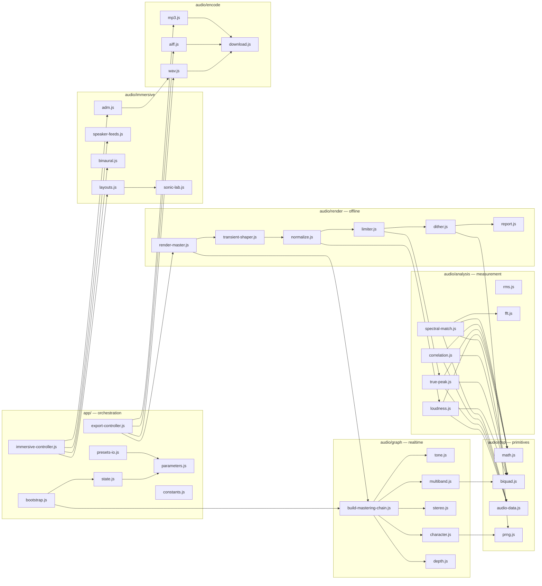
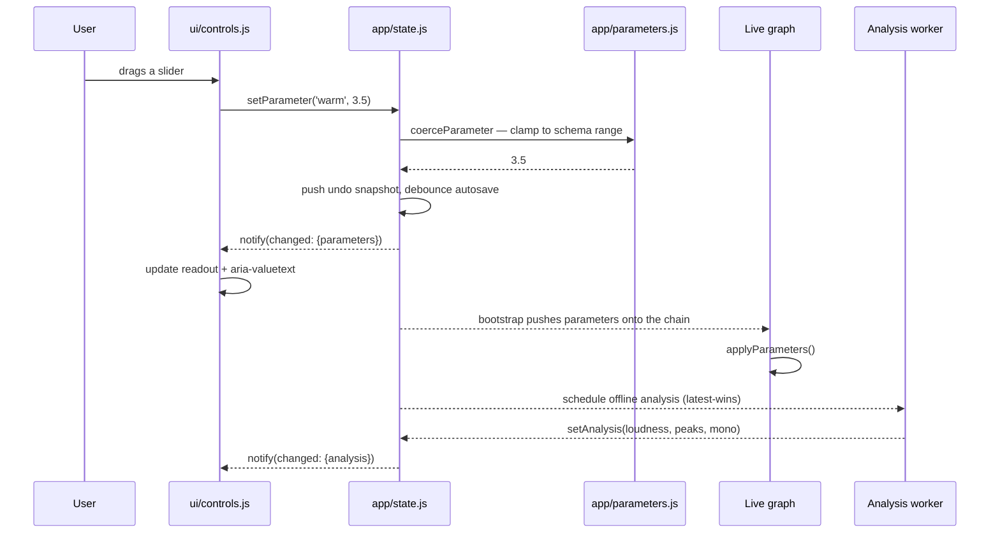
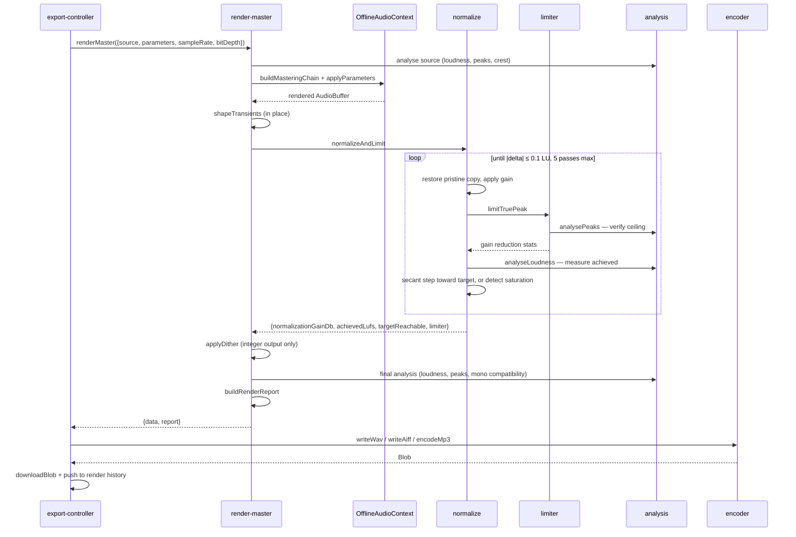
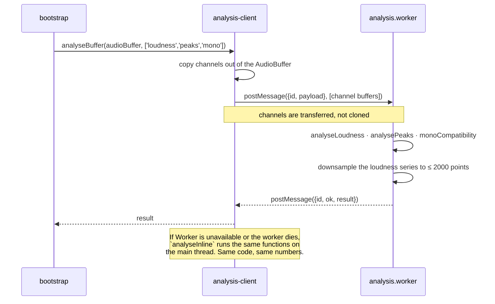

# Architecture

## The organising principle

**Every numeric routine is a pure function over plain typed arrays.**

That single rule produced most of the structure in this repository. It means the whole DSP
layer runs in Node with no browser, no DOM and no mocking framework, which in turn means
the loudness meter, the limiter, the crossover, the encoders and the ADM writer are all
covered by fast, deterministic tests. Web Audio types appear in exactly three places:

1. `audio/dsp/audio-data.js` — two adapter functions between `AudioBuffer` and `AudioData`
2. `audio/graph/*` and `audio/immersive/*` — node-graph construction
3. `audio/context.js` — context creation and capability probing

Everything else operates on:

```js
/** @typedef {{sampleRate: number, length: number, channels: Float32Array[]}} AudioData */
```

`fromAudioBuffer()` returns a **zero-copy view**: `getChannelData()` hands back the live
backing store, so the render pipeline mutates the `AudioBuffer` in place rather than
duplicating 400 MB of float data at every stage.

## Module map



## Dependency direction

Strictly one way:

```
ui/ · visualizers/  →  app/  →  audio/  →  audio/dsp/
                                  ↓
                              presets/
```

- `audio/**` never imports from `ui/**` or `app/bootstrap.js`.
- `audio/dsp/**` imports nothing but other `dsp` modules.
- `presets/**` imports only `presets/_shared.js`.
- `ui/**` imports from `app/parameters.js` and `app/constants.js` but never constructs
  audio nodes.

This is what makes the DSP suite runnable in a Node environment: importing
`audio/analysis/loudness.js` pulls in exactly `dsp/math.js` and `dsp/biquad.js`.

## State



Key properties:

- **One canonical object.** `state.parameters` is the only parameter store. There is no
  second copy inside the graph, the UI or the export controller.
- **Validated on every write.** `setParameter` runs `coerceParameter`, which clamps to the
  schema range and rejects non-finite input. `setParameters` runs the full
  `validateParameters`, which additionally drops unknown keys.
- **Change subscriptions.** `subscribe(fn)` fires with the set of changed top-level slices
  (`parameters`, `ui`, `immersive`, `source`, `analysis`) so listeners can skip work.
- **Bounded undo.** Sixty parameter snapshots, arrays copied by value.
- **Autosave.** Parameters, immersive settings and UI preferences are written to
  `localStorage` on a 400 ms debounce. Audio is never stored.

## The parameter schema

`app/parameters.js` declares every user-facing value exactly once:

```js
{
  key: 'bassMono',
  type: 'number',
  defaultValue: 0,
  min: 0, max: 400, step: 5,
  unit: 'Hz',
  label: 'Mono below',
  hint: '4th-order Linkwitz-Riley high-pass on the side channel: 24 dB/octave.',
  group: 'stereo',
  displayFormatter: (v) => (v > 0 ? `${Math.round(v)} Hz` : 'off'),
  previewSupported: true,
  exportSupported: true,
}
```

From this one declaration the application derives:

- the slider, its range, its step and its label
- the value readout and the `aria-valuetext` a screen reader announces
- the `export only` badge, when `previewSupported` is false
- the entry in the About tab's live-versus-export table
- clamping on every write, including preset load
- the row in `docs/PRESET-SCHEMA.md`

The pre-7.0 build had forty-two hand-written DOM writes in `syncControls()` plus forty
`bindRange()` calls, each repeating the same unit conversion. That is how the UI came to
say "Body — peaking 700 Hz" about a filter at 350 Hz. The tone-band labels are now
generated from `TONE_BANDS` in `audio/graph/tone.js`, the same table the filters are built
from, so they cannot drift apart again.

## Audio graph construction

There is exactly **one** chain constructor, `buildMasteringChain(ctx)`, and exactly **one**
parameter application function, `applyParameters(chain, params, opts)`. Both the live graph
and every offline render call them. This is the main structural guarantee that preview and
export agree — where they differ, they differ because a stage is _absent_ from the live
path, not because a second implementation drifted.

```mermaid
graph LR
  IN[input] --> TRIM[trim]
  TRIM --> M1[match 60] --> M2[…] --> M8[match 12k]
  M8 --> TONE_IN[tone: 6 biquads + tilt pair]
  TONE_IN --> MB_IN[multiband input]

  subgraph "multiband — serial LR4"
    MB_IN --> LP1[LP4 140] --> AP2[AP2 3.2k] --> CL[comp low] --> ML[makeup] --> SL[solo] --> WET[wet]
    MB_IN --> HP1[HP4 140]
    HP1 --> LP2[LP4 3.2k] --> CM[comp mid] --> MM[makeup] --> SM[solo] --> WET
    HP1 --> HP2[HP4 3.2k] --> CH[comp high] --> MH[makeup] --> SH[solo] --> WET
    MB_IN --> DA1[AP2 140] --> DA2[AP2 3.2k] --> DRY[dry]
  end

  WET --> MB_OUT[multiband output]
  DRY --> MB_OUT
  MB_OUT --> SPLIT[splitter]

  subgraph "stereo — M/S"
    SPLIT --> MID[mid = 0.5L + 0.5R] --> MG[mid gain]
    SPLIT --> SIDE[side = 0.5L − 0.5R] --> BHP[LR4 HP bass-mono]
    BHP --> WL[LP4 250 × widthLow]
    BHP --> WM[BP 250–4k × widthMid]
    BHP --> WH[HP4 4k × widthHigh]
    WL & WM & WH --> WSUM[side sum] --> SW[width] --> SMIX[direct + allpass blend]
    MG & SMIX --> DEC[L = M+S, R = M−S] --> HAAS[haas delays] --> CF[crossfeed] --> MERGE[merger]
  end

  MERGE --> AUD[audition matrix]
  AUD --> CHAR_IN[character]
  CHAR_IN --> TAPE[modulated delay] --> HB[head bump] --> HF[HF rolloff] --> CHAR_OUT[character out]
  NOISE[seeded hiss · crackle · rumble] --> CHAR_OUT
  CHAR_OUT --> DEPTH_IN[depth: direct + 2 filtered taps] --> SAT_IN[dc block]
  SAT_IN --> PRE[pre-gain] --> SHAPE[waveshaper 4×] --> POST[post LP] --> MAKEUP[makeup] --> OUT[output]
```



Two design decisions worth calling out:

**Bypass neutralises rather than rewires.** Disconnecting and reconnecting nodes during
playback clicks. Bypass sets a module's parameters to their neutral values instead. The
consequence is that a bypassed multiband or stereo section is still in the signal path, and
both are all-pass in their neutral state — documented, tested, and inaudible.

**Saturation make-up has its own node.** In the pre-7.0 build, `outGain` carried both the
saturation make-up gain and the preview normalisation gain, and the second write destroyed
the first. Preview and export differed by up to 1.9 dB at full saturation. Two
responsibilities, two nodes.

## Offline render pipeline



## Worker communication



`createAnalysisScheduler()` wraps this in a latest-wins debounce. The pre-7.0 build fired
a full offline re-render 480 ms after _every_ slider movement with no way to abandon an
in-flight one, so dragging a fader queued a dozen full-file analyses. Superseded requests
now resolve to `null` and are discarded.

## Rendering loop

One `requestAnimationFrame` loop, throttled to ~40 fps, drawing only what is visible:

- Waveform (peak envelope cached per file per canvas width)
- Spectrum and vectorscope (only when the scopes row is visible)
- Speaker map (only when the Immersive tab is open and a layout is selected)
- Meters and per-band gain reduction

Allocation discipline: `visualizers/canvas-util.js` pools every typed array by key and
resizes a canvas only when its CSS size or the device pixel ratio actually changed. The
pre-7.0 loop allocated six `Float32Array`s per frame — roughly 1.5 MB/s of garbage at
60 fps — and reassigned `canvas.width` on the waveform every frame, forcing a full
backing-store reallocation. The loop also stops entirely when the tab is hidden.

## Security posture

| Surface         | Treatment                                                                                                                                                                                                             |
| --------------- | --------------------------------------------------------------------------------------------------------------------------------------------------------------------------------------------------------------------- |
| Filenames       | `sanitizeFilename()` strips path separators, control characters, Windows-forbidden characters, reserved device names, leading dots and trailing dots/spaces; truncates to 120 characters preserving a short extension |
| DOM             | `ui/dom.js` `el()` sets `textContent`, never `innerHTML`, for any dynamic value. The pre-7.0 batch list interpolated `file.name` into `innerHTML` — a stored-XSS sink                                                 |
| Preset JSON     | Size-limited before parsing, type-checked before property access, unknown keys dropped, every value clamped, prototype-pollution payloads inert                                                                       |
| ADM XML         | Every interpolated string passes through `xmlEscape()`; a hostile programme name cannot break the document                                                                                                            |
| Network         | Zero runtime network dependencies. `lamejs` is bundled and code-split                                                                                                                                                 |
| Object URLs     | Tracked in a set, revoked on `pagehide` and after a 60 s grace period, never after a fixed 2 s that could truncate a large download                                                                                   |
| Promises        | A global `unhandledrejection` handler surfaces errors and calls `preventDefault()`                                                                                                                                    |
| Resource limits | File size, duration and total-sample guards with explicit refusals and warnings                                                                                                                                       |

## What was rejected

**`AudioWorklet`.** It would give a real per-sample limiter and transient shaper in the
live monitor, closing the largest preview/export gap. It was rejected for now because the
worklet module must be fetched from a URL, which breaks the "open the HTML file and it
works" property and complicates any strict CSP. It is on the roadmap, and the parameter
schema already models the divergence so the migration is additive.

**A second DSP implementation for offline rendering.** Tempting — it would allow a linear-
phase crossover and a proper oversampled saturator. Rejected because two implementations of
the same chain diverge, and preview/export divergence is the defect this refactor exists to
eliminate.

**Removing the destructive controls.** The Haas widener, the side comb blend and the wide
presets all damage mono compatibility. They stay, because the point of Signal Rot is to let
you build a strange master on purpose. What changed is that the system now tells you which
kind of strange you are being.
