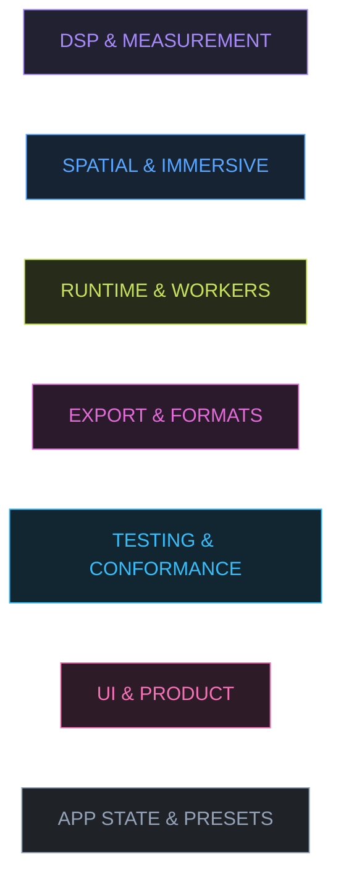

# Colour system — domain coding

**What this is:** one consistent palette that colours the _organisation of the repository_
— docs, diagrams, the module map, GitHub labels — so that "DSP", "spatial", "runtime",
"export", "testing", "UI" and "app" look the same everywhere they appear.

**What this is not:** a third signal accent. The identity of the product stays exactly two
colours, unchanged, and this document does not touch that rule.

| Identity (signal state) | Token    | Hex (dark) | Hex (light) | Meaning                |
| ----------------------- | -------- | ---------- | ----------- | ---------------------- |
| Original                | `--orig` | `#36d1c4`  | `#0a8f86`   | the unprocessed signal |
| Processed               | `--proc` | `#f5a623`  | `#b3690f`   | the mastered signal    |
| Danger                  | `--hot`  | `#ff4d57`  | `#c4272f`   | a ceiling was crossed  |
| Pass                    | `--ok`   | `#6ee7a8`  | `#14794b`   | a claim held           |
| Warn                    | `--warn` | `#ffc861`  | `#96650a`   | a hazard worth a look  |

Those five mean _audio state_. The seven below mean _where in the repository you are_.
No component mixes the two lists, and no `--dom-*` colour may ever fill a meter, a scope, a
bypass dot or a waveform.

---

## The seven domain colours

Defined once in [`src/styles/tokens.css`](../src/styles/tokens.css) as `--dom-<domain>` /
`--dom-<domain>-soft` / `--dom-<domain>-line`, for both themes. Diagrams repeat the hexes
as literal values (Mermaid cannot read CSS); the mirror is enforced by a test, not by
vigilance — see [sync](#sync-code--docs--labels).

| Domain  | Swatch (dark / light) | Token           | Tint token      | Lines | Identity                                  |
| ------- | --------------------- | --------------- | --------------- | ----: | ----------------------------------------- |
| DSP     | `#a78bfa` / `#6d28d9` | `--dom-dsp`     | violet          | 4,855 | the engine — measurement is part of it    |
| SPATIAL | `#58a6ff` / `#1d4ed8` | `--dom-spatial` | azure           |   856 | immersive beds, speaker fields, Sonic Lab |
| RUNTIME | `#c8e15c` / `#456f0d` | `--dom-runtime` | chartreuse      |   386 | jobs, workers, budgets, preflight         |
| EXPORT  | `#e26bd8` / `#a21caf` | `--dom-export`  | fuchsia         | 3,119 | encoders, containers, ADM, delivery       |
| TESTING | `#38bdf8` / `#0369a1` | `--dom-testing` | sky             |     — | suites, conformance lab, CI gates         |
| UI      | `#f472b6` / `#be185d` | `--dom-ui`      | pink            | 5,460 | controls, visualizers, styles, surface    |
| APP     | `#94a3b8` / `#475569` | `--dom-app`     | slate (neutral) | 5,064 | state, schema, presets, wiring            |

The swatch legend rendered with the actual class definitions every diagram uses:



_(The swatch board and every diagram below assume the dark canvas; on GitHub the node
fills are explicit, so they render identically in either interface theme.)_

---

## Rules of the system

1. **One primary domain per directory.** Every path in `src/`, `tests/`, `tools/`, `docs/`,
   `ci/` and `.github/` maps to exactly one domain (table below). A file that genuinely
   serves two areas — the ADM writer, the spatial lab UI — lists the boundary in its own
   row and draws a dotted edge in diagrams. Dotted means _co-owned_, never _unclear_.
2. **Colour is never the only channel.** A domain colour always sits next to the domain's
   name — `● DSP` in a table, a labelled node in a diagram, `area:dsp` as a label. This is
   the same "not just color" rule the interface uses for bypass state
   ([`docs/PRODUCT-EXPERIENCE.md`](PRODUCT-EXPERIENCE.md)).
3. **Domain colours never encode state.** Pass/fail, over/under, original/processed remain
   `--ok` / `--hot` / `--orig` / `--proc` territory. If a `--dom-*` value appears in a
   component that also shows signal, that is a defect.
4. **Diagrams keep one classDef block.** The seven `classDef dom-*` lines above are the
   canonical block; copy the lines a diagram needs verbatim so all diagrams age together.
   `tests/app/visual-system.test.js` fails the build when a diagram drifts: stroke and
   label ink must equal the token value from `tokens.css`, and `fill` must be a literal
   six-digit tint (Mermaid reads no CSS).
5. **Agents inherit the colour of the ground they own.** The ownership map
   ([`docs/WORKSTREAMS.md`](WORKSTREAMS.md)) uses domain colours for workstreams; an agent
   with two domains (A: DSP + spatial engine) shows both swatches, side by side.

---

## Repo map — every directory, one domain

| Domain                  | Paths                                                                                                                                                                                                                  | What lives there                                                                                                                        | Tests (count)                                                                     | Docs                                                                                                                                                                                                |
| ----------------------- | ---------------------------------------------------------------------------------------------------------------------------------------------------------------------------------------------------------------------- | --------------------------------------------------------------------------------------------------------------------------------------- | --------------------------------------------------------------------------------- | --------------------------------------------------------------------------------------------------------------------------------------------------------------------------------------------------- |
| ● **DSP** `#a78bfa`     | `src/audio/dsp/` · `src/audio/analysis/` · `src/audio/graph/` · `src/audio/render/` · `src/audio/adaptive/` · `src/audio/context.js`                                                                                   | pure-function numerics, realtime chain, offline render maths, source-aware adaptation, K-weighting / true-peak / FFT maths              | `tests/dsp/` (238) · `tests/integration/` (154)                                   | [`DSP-SIGNAL-FLOW.md`](DSP-SIGNAL-FLOW.md) · [`LOUDNESS-ANALYSIS.md`](LOUDNESS-ANALYSIS.md) · [`TRUE-PEAK-LIMITER.md`](TRUE-PEAK-LIMITER.md) · [`GAIN-STRUCTURE-AUDIT.md`](GAIN-STRUCTURE-AUDIT.md) |
| ● **SPATIAL** `#58a6ff` | `src/audio/immersive/` (except `adm.js` → EXPORT) · `src/app/immersive-controller.js` · `src/ui/spatial-lab.js` · `src/visualizers/{speaker-map,elevation-view,spatial-energy,motion-viz}.js`                          | 5.1 → 9.1.6 + Sonic Lab 20.4 layouts, feeds, binaural monitor, the second workspace                                                     | `tests/format/{layouts,adm}.test.js` (shared) · `tests/browser/immersive.spec.js` | [`IMMERSIVE-AUDIO.md`](IMMERSIVE-AUDIO.md) · [`SONIC-LAB-20.4.md`](SONIC-LAB-20.4.md)                                                                                                               |
| ● **RUNTIME** `#c8e15c` | `src/runtime/` · `src/workers/`                                                                                                                                                                                        | job scheduler, worker RPC, memory budget, render preflight, waveform pyramid, analysis client + worker                                  | `tests/runtime/` (6)                                                              | [`src/runtime/README.md`](../src/runtime/README.md)                                                                                                                                                 |
| ● **EXPORT** `#e26bd8`  | `src/audio/encode/` · `src/audio/immersive/adm.js` (writers, boundary with SPATIAL) · `src/app/export-controller.js` · `src/ui/export-summary.js` (boundary with UI) · `.github/workflows/export-interoperability.yml` | WAV / BWF / RF64 / BW64 / AIFF / MP3, channel identification, delivery packages + manifests + checksums, ADM AXML/BWF, download hygiene | `tests/format/` (159) · `tests/interoperability/` (333)                           | [`EXPORT-INTEROPERABILITY.md`](EXPORT-INTEROPERABILITY.md)                                                                                                                                          |
| ● **TESTING** `#38bdf8` | `tests/` (the suites themselves) · `e2e/` · `tests/browser/` · `tests/conformance/` · `ci/` · `tools/audio-regression/` · `tools/benchmarks/` · `tools/conformance/`                                                   | every suite, the golden bank, the real-browser conformance lab, CI entry points, the findings inbox                                     | 1,068 Vitest + 37 Playwright e2e + 7 browser conformance specs                    | [`TESTING.md`](TESTING.md) · [`CONFORMANCE.md`](CONFORMANCE.md) · [`AUDIO-REGRESSION.md`](AUDIO-REGRESSION.md) · [`FINDINGS-FOR-AGENT-A.md`](FINDINGS-FOR-AGENT-A.md)                               |
| ● **UI** `#f472b6`      | `src/ui/` (except the two controllers above) · `src/visualizers/` (except the four above) · `src/styles/` · `index.html`                                                                                               | schema-generated controls, tabs, transport, A/B, macros, presets browser, themes, scopes, the token system                              | `tests/ui/` (52) · `e2e/{accessibility,responsive}.spec.js`                       | [`PRODUCT-EXPERIENCE.md`](PRODUCT-EXPERIENCE.md)                                                                                                                                                    |
| ● **APP** `#94a3b8`     | `src/app/` (state, parameters, presets-io, constants, bootstrap) · `src/presets/` · `src/main.js` · `vite.config.js`                                                                                                   | the single validated store, the parameter schema, 72 presets in 8 groups, engine identity, guards                                       | `tests/app/` (93 — incl. the visual-system guard)                                 | [`PRESET-SCHEMA.md`](PRESET-SCHEMA.md)                                                                                                                                                              |

### The machine-readable map

The same rules as JSON — a fence block that `tests/app/visual-system.test.js` parses: every
claimed directory in `src/`, `tests/`, `tools/`, `ci/`, `e2e/` and `.github/` must resolve to
**exactly one** domain by longest-prefix match. Boundary files are claimed by their writer
(`adm.js` is EXPORT even though it sits inside SPATIAL's directory) — the directory check is
deliberately file-blind, which is how a co-owned tree stays honestly partitioned.

```json domain-map.v1
{
  "version": 1,
  "domains": {
    "dsp": [
      "src/audio",
      "src/audio/dsp",
      "src/audio/analysis",
      "src/audio/graph",
      "src/audio/render",
      "src/audio/adaptive",
      "src/audio/context.js",
      "tests/dsp",
      "tests/integration",
      "tests/fixtures"
    ],
    "spatial": [
      "src/audio/immersive",
      "src/ui/spatial-lab.js",
      "src/app/immersive-controller.js",
      "src/visualizers/speaker-map.js",
      "src/visualizers/elevation-view.js",
      "src/visualizers/spatial-energy.js",
      "src/visualizers/motion-viz.js",
      "docs/IMMERSIVE-AUDIO.md",
      "docs/SONIC-LAB-20.4.md"
    ],
    "runtime": ["src/runtime", "src/workers", "tests/runtime", "src/runtime/README.md"],
    "export": [
      "src/audio/encode",
      "src/audio/immersive/adm.js",
      "src/app/export-controller.js",
      "src/ui/export-summary.js",
      "tools/export-validation",
      "tests/format",
      "tests/interoperability",
      ".github/workflows/export-interoperability.yml",
      "docs/EXPORT-INTEROPERABILITY.md"
    ],
    "testing": [
      "tests/conformance",
      "tests/browser",
      "tests/helpers",
      "e2e",
      "ci",
      "tools/audio-regression",
      "tools/benchmarks",
      "tools/conformance",
      ".github",
      "docs/TESTING.md",
      "docs/CONFORMANCE.md",
      "docs/AUDIO-REGRESSION.md",
      "docs/FINDINGS-FOR-AGENT-A.md"
    ],
    "ui": [
      "src/ui",
      "src/visualizers",
      "src/styles",
      "index.html",
      "tests/ui",
      "docs/PRODUCT-EXPERIENCE.md"
    ],
    "app": [
      "src/app",
      "src/presets",
      "src/main.js",
      "tests/app",
      "docs/PRESET-SCHEMA.md",
      "docs/COLOR-SYSTEM.md",
      "docs/WORKSTREAMS.md",
      "CHANGELOG.md",
      "CONTRIBUTING.md",
      "README.md"
    ]
  }
}
```

Line counts are non-blank source lines of the domain's primary paths, measured at this
commit: DSP `audio/{dsp,analysis,graph,render,adaptive}` + `context.js` (25 files);
SPATIAL `audio/immersive` minus `adm.js` (its own count, since the writer is EXPORT);
RUNTIME `runtime + workers` (8 files); EXPORT `audio/encode` + `immersive/adm.js` +
`app/export-controller.js`; UI `ui + visualizers + styles`; APP `src/app` + `presets` +
`main.js`. `npm run test` prints the live counts.

---

## GitHub labels — the same colours on PRs and issues

[`.github/labeler.yml`](../.github/labeler.yml) routes every PR to these labels from the
touched paths, using the identical glob rules as the table above. The colours below are the
same hexes, so a triaged PR is literally coloured by its domain.

| Label          | Colour   | Created with (one-time, repo admin)                                                                                                               |
| -------------- | -------- | ------------------------------------------------------------------------------------------------------------------------------------------------- |
| `area:dsp`     | `a78bfa` | `gh label create area:dsp --color a78bfa --color-dark a78bfa --description "DSP & measurement — audio/dsp, graph, render, analysis"`              |
| `area:spatial` | `58a6ff` | `gh label create area:spatial --color 58a6ff --color-dark 58a6ff --description "Spatial & immersive — layouts, feeds, Sonic Lab, spatial lab UI"` |
| `area:runtime` | `c8e15c` | `gh label create area:runtime --color c8e15c --color-dark c8e15c --description "Runtime & workers — scheduler, RPC, budgets, preflight"`          |
| `area:export`  | `e26bd8` | `gh label create area:export --color e26bd8 --color-dark e26bd8 --description "Export & formats — encoders, ADM, delivery, interoperability"`     |
| `area:testing` | `38bdf8` | `gh label create area:testing --color 38bdf8 --color-dark 38bdf8 --description "Testing & conformance — suites, golden bank, browser lab, CI"`    |
| `area:ui`      | `f472b6` | `gh label create area:ui --color f472b6 --color-dark f472b6 --description "UI & product — controls, visualizers, styles"`                         |
| `area:app`     | `94a3b8` | `gh label create area:app --color 94a3b8 --color-dark 94a3b8 --description "App state & presets — store, schema, catalogue"`                      |

Labels must exist before the labeler can apply them; missing labels are skipped with a
warning, so this is additive and self-healing.

---

## Recipes — diagrams that stay on-system

Paste this block into any `mermaid` fence and use `:::dom-<domain>` on nodes
(the full canonical classDef set from the swatch board above is what the test looks for;
include the domains your diagram actually uses):

```
  classDef dom-dsp fill:#222131,stroke:#a78bfa,color:#a78bfa
  classDef dom-spatial fill:#152332,stroke:#58a6ff,color:#58a6ff
  classDef dom-runtime fill:#262c19,stroke:#c8e15c,color:#c8e15c
  classDef dom-export fill:#2a1a2c,stroke:#e26bd8,color:#e26bd8
  classDef dom-testing fill:#112631,stroke:#38bdf8,color:#38bdf8
  classDef dom-ui fill:#2d1b27,stroke:#f472b6,color:#f472b6
  classDef dom-app fill:#1f2328,stroke:#94a3b8,color:#94a3b8
```

Conventions the repo's diagrams follow:

- **Subgraphs are the domain, nodes are the files.** A subgraph gets
  `style NAME fill:<soft>,stroke:<accent>`; a node gets the class.
- **Boundaries are dotted edges.** `A -. adapter boundary .-> B` marks the seam between an
  owner and a consumer, matching the `// adapter boundary` comment convention in code.
- **Offline-only stages carry the `· export only` suffix**, the same honesty the live UI
  applies with its badges.

In Markdown tables, a coloured cell is just the bullet: `●` inside backticks next to the
hex. Do not inline `<span style>`; GitHub strips it.

---

## Sync: code ↔ docs ↔ labels

The claim _"the same colour means the same thing everywhere"_ is a claim, and per
[CONTRIBUTING.md](../CONTRIBUTING.md) claims get tests. `tests/app/visual-system.test.js`
asserts, on every `npm run test`:

1. `tokens.css` defines all seven `--dom-*` tokens in **both** theme blocks;
2. every dark accent clears 4.5 : 1 against the dark `--bg`, every light accent against the
   light `--bg` (computed, not asserted by eye);
3. every `classDef dom-*` in the README and `docs/*.md` repeats the registered hex — no
   rogue shades;
4. the repo map above covers every first-level directory of `src/` exactly once;
5. `.github/labeler.yml` uses the same seven label names as this document.

Change a colour? Change `tokens.css`, rerun the test, and let it name every diagram that
needs the new value.

## Where these colours show up today

- `docs/ARCHITECTURE.md` — module map, dependency direction, pipeline and worker diagrams
- `docs/DSP-SIGNAL-FLOW.md` — the signal path, stage by stage
- `docs/TESTING.md` — the test pipeline, suite sizes
- `docs/WORKSTREAMS.md` — ownership and the findings loop
- `README.md` — architecture flow, signal flow, workstreams, testing pipeline, legend
- [`.github/labeler.yml`](../.github/labeler.yml) — `area:*` labels on PRs

**Deliberately not used yet:** any in-app component. The lab keeps its two-accent identity;
`--dom-*` tokens exist for a future, optional adoption (section chips, About-tab group
headers) that would need its own design pass and product-experience review.
