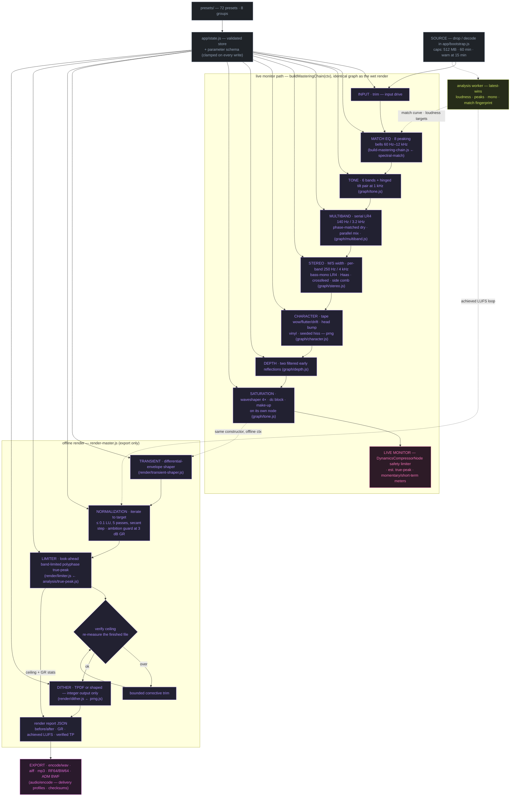

# DSP signal flow

The order of a mastering chain is an argument, not a convention. This document makes the
argument, states what changed from the pre-7.0 chain, and records the measured
consequences.

## The chain, drawn

Every node below is a stage in `SIGNAL_FLOW` (`src/app/constants.js`); the colour is the
stage's owning domain from [COLOR-SYSTEM.md](COLOR-SYSTEM.md), the module that builds it
sits inside the node. Everything past the dashed divider is inside `renderMaster()` —
export-only, labelled as such in the live UI.



Read it together with the text chain below; the diagram adds _who builds what_ and _who
measures what_, the text keeps the argument for the order.

### Stage ownership

| Stage          | Domain   | Built by                                                | Measured by                                  |    Live     | Export |
| -------------- | -------- | ------------------------------------------------------- | -------------------------------------------- | :---------: | :----: |
| INPUT / trim   | ● APP    | `graph/build-mastering-chain.js`                        | —                                            |      ✓      |   ✓    |
| MATCH EQ       | ● DSP    | `build-mastering-chain.js` (8 bells from `MATCH_FREQS`) | `analysis/spectral-match.js` → FFT           |      ✓      |   ✓    |
| TONE           | ● DSP    | `graph/tone.js`                                         | `tests/dsp/biquad` + label-from-table        |      ✓      |   ✓    |
| MULTIBAND      | ● DSP    | `graph/multiband.js`                                    | crossover null test, 0.00000 dB              |      ✓      |   ✓    |
| STEREO         | ● DSP    | `graph/stereo.js`                                       | correlation / mono-compat analysis           |      ✓      |   ✓    |
| CHARACTER      | ● DSP    | `graph/character.js`                                    | seeded-PRNG determinism tests                |      ✓      |   ✓    |
| DEPTH          | ● DSP    | `graph/depth.js`                                        | topology tests (fake context)                |      ✓      |   ✓    |
| SATURATION     | ● DSP    | `graph/tone.js` (`buildSaturation`)                     | waveshaper monotonicity, alias capture (lab) |      ✓      |   ✓    |
| TRANSIENT      | ● DSP    | `render/transient-shaper.js`                            | `tests/dsp/transient-shaper`                 |      —      |   ✓    |
| NORMALIZATION  | ● DSP    | `render/normalize.js`                                   | loudness loop + report                       |   approx.   |   ✓    |
| LIMITER        | ● DSP    | `render/limiter.js`                                     | `tests/dsp/limiter` + verified re-measure    | safety comp |   ✓    |
| VERIFY ceiling | ● DSP    | re-analysis in `render-master.js`                       | independent parse at export gate             |      —      |   ✓    |
| DITHER         | ● DSP    | `render/dither.js`                                      | TPDF statistics tests                        |      —      |   ✓    |
| ENCODE / ADM   | ● EXPORT | `audio/encode/**`, `immersive/adm.js`                   | `tests/format` + `tests/interoperability`    |      —      |   ✓    |

## The chain

```
INPUT
  ↓  input drive (trim)
MATCH EQ        corrective — 8 peaking bells, derived from a reference measurement
  ↓
TONE            tonal — 6 bands + a hinged tilt pair at 1 kHz
  ↓
MULTIBAND       dynamics — serial LR4 at 140 Hz / 3.2 kHz, phase-matched dry path
  ↓
STEREO          spatial — M/S width, per-band width, bass mono, Haas, crossfeed
  ↓
CHARACTER       colour — tape modulation, head bump, HF roll-off, seeded noise beds
  ↓
DEPTH           spatial — two filtered early reflections
  ↓
SATURATION      colour — waveshaper with gain staging and a post low-pass
  ↓
─────────────── everything below runs offline only ───────────────
TRANSIENT       dynamics — differential-envelope shaper
  ↓
NORMALIZATION   delivery — iterated to the loudness target
  ↓
LIMITER         delivery — look-ahead true-peak, then verified
  ↓
DITHER          delivery — TPDF or 2nd-order shaped, integer output only
  ↓
EXPORT
```

## Why this order

### 1. Corrective before tonal

Match EQ is derived from a measurement of the **source**. If tonal EQ ran first, the match
curve would be correcting a signal that no longer matches what was measured, and the two
stages would fight. Corrective first, creative second — the same reason a mastering
engineer measures before reaching for a shelf.

### 2. Dynamics before spatial

**This is the one change from the pre-7.0 order that alters the sound, and it is the one
worth arguing for.** The audited chain also ran multiband before stereo, so in practice
this is a confirmation rather than a change — but the reasoning was never written down and
it is not obvious.

A stereo-linked multiband compressor working on an already-widened signal reacts to side
energy that did not exist when the mix was made. Push the width to 180 % and the low band's
detector now sees the widened bass; it compresses differently, and because the detector is
linked, its gain movement pulls the whole image. Compress the mix, then image the result.

The corollary: **changing the width control should not change how much the compressor
works.** With this order, it does not.

### 3. Spatial before colour

Tape modulation and early reflections should apply to the finished image. The alternative —
widening a delayed reflection — produces a smeared, unstable rear image, because the
widener is operating on a signal whose two channels are already decorrelated by the
reflection. The side channel of a reflection is close to noise; multiplying it is not
imaging, it is just more noise.

### 4. Saturation last of the colour stages

Saturation is the only genuinely non-linear stage in the chain (the multiband is dynamic
but not harmonic). It should see the final spectrum. Putting it before EQ means you are
equalising harmonics you generated, rather than generating harmonics from the sound you
actually want — and every subsequent EQ move changes the harmonic balance in ways that are
hard to predict.

### 5. Transient shaping after colour, before normalisation

It changes crest factor, so normalisation must see the result or the target will be missed.
And it should act on the finished tone: a transient shaper responds to the envelope, and
the envelope of a saturated signal is not the envelope of a clean one.

It runs offline because per-sample gain computation is not available from native Web Audio
nodes without an `AudioWorklet`, which this project deliberately avoids (see
[`ARCHITECTURE.md`](ARCHITECTURE.md#what-was-rejected)).

### 6. Normalise, then limit, then check

Normalise-then-limit does not deliver the target, because limiting removes energy. The
export therefore iterates. See [`TRUE-PEAK-LIMITER.md`](TRUE-PEAK-LIMITER.md#normalisation-convergence).

---

## Stage detail

### Match EQ

Eight peaking filters in series at 60, 150, 400, 1 000, 2 500, 5 000, 8 000 and 12 000 Hz,
Q = 1.0. A ⅔-octave bell at each band overlaps its neighbours enough that a smooth target
curve produces a smooth response rather than eight discrete bumps.

Gains come from `analysis/spectral-match.js` and are scaled by the strength control. Flat
by default; at zero strength the section is bit-transparent.

### Tone

| Control   | Filter            | Frequency | Q      | Range  |
| --------- | ----------------- | --------- | ------ | ------ |
| Sub       | low shelf         | 55 Hz     | 0.7071 | ±12 dB |
| Warmth    | low shelf         | 120 Hz    | 0.7071 | ±12 dB |
| Body      | peaking           | 350 Hz    | 0.7    | ±12 dB |
| Harshness | peaking           | 2 800 Hz  | 1.2    | ±12 dB |
| Clarity   | peaking           | 5 000 Hz  | 0.8    | ±12 dB |
| Air       | high shelf        | 12 000 Hz | 0.7071 | ±12 dB |
| Tilt      | hinged shelf pair | 1 000 Hz  | 0.7071 | ±6 dB  |

These frequencies are declared once, in `TONE_BANDS`, and both the filters and the UI
labels are generated from that table. The pre-7.0 UI claimed 170 Hz, 700 Hz and 3 kHz for
filters that actually sat at 120 Hz, 350 Hz and 2 800 Hz.

**Sub and Warmth overlap.** Both are low shelves; at 50 Hz they add. `sub: 4` plus
`warm: 2` is about +6 dB at 50 Hz, not +4. The preset safety tests enforce a 6 dB cap on
the stacked pair.

### Multiband

Serial Linkwitz-Riley 4th-order split:

```
low   = LP4(140) → AP2(3200)
mid   = HP4(140) → LP4(3200)
high  = HP4(140) → HP4(3200)
dry   = AP2(140) → AP2(3200)
```

The all-pass on the low band is what makes the three-way sum exact:

```
low + mid + high = LP4(140)·AP2(3200) + HP4(140)·[LP4(3200) + HP4(3200)]
                 = LP4(140)·AP2(3200) + HP4(140)·AP2(3200)
                 = AP2(3200)·[LP4(140) + HP4(140)]
                 = AP2(140)·AP2(3200)
```

using the identity that an LR4 crossover sum is a **single** 2nd-order all-pass at the same
corner and Q:

```
LP2² + HP2² = (1 + s⁴)/(s² + √2s + 1)²
            = (s² − √2s + 1)(s² + √2s + 1)/(s² + √2s + 1)²
            = (s² − √2s + 1)/(s² + √2s + 1)          ← AP2
```

Note that `LP2 + HP2` on its own is **not** all-pass — it is a notch at f₀. The
fourth-order pairing is what produces the cancellation. Cascading two all-pass sections in
the dry path (an easy mistake, and one made and caught during this refactor) doubles the
phase rotation and reintroduces the comb.

**Ideal-filter reconstruction**, `tests/dsp/multiband-crossover.test.js` (Node maths,
not a real Web Audio render):

| Parallel mix | Pre-7.0 topology      | Current topology |
| ------------ | --------------------- | ---------------- |
| 100 %        | −0.02 dB              | **0.00000 dB**   |
| 75 %         | −6.04 dB @ 3.26 kHz   | **0.00000 dB**   |
| 50 %         | **−58.9 dB @ 137 Hz** | **0.00000 dB**   |
| 25 %         | −6.01 dB @ 137 Hz     | **0.00000 dB**   |

The browser lab does **not** confirm a flat wet sum: Chromium measured about +7.39 dB
at the crossovers with inactive compressors. Keep the 1.5 dB browser contract intact;
see [finding A-6](FINDINGS-FOR-AGENT-A.md#measured-in-a-real-browser). The analytical
results above are not evidence that this remaining DSP defect is resolved.

The pre-7.0 build mixed the all-pass band sum against an unfiltered dry wire. At the 50 %
mix its own UI called "the audiophile move", that is a complete null at both crossover
frequencies. Five shipped presets used partial parallel mix and were all producing broken
audio.

**Amount mapping.** The 0–100 control maps to a threshold and ratio the UI now displays:

| Amount | Threshold | Ratio   |
| ------ | --------- | ------- |
| 0      | 0 dB      | 1.0 : 1 |
| 25     | −6 dB     | 1.5 : 1 |
| 50     | −12 dB    | 2.0 : 1 |
| 75     | −18 dB    | 2.5 : 1 |
| 100    | −24 dB    | 3.0 : 1 |

**Knee and ballistics.** The knee is 12 dB. Attack/release values are defined in
`MB_BALLISTICS` in `src/audio/graph/multiband.js`; use that table rather than old preset-era timings.

**The compressors are `DynamicsCompressorNode`s.** Fixed topology, implementation-defined
internals. The dry path carries `MB_COMPRESSOR_LOOKAHEAD_S` (6 ms) to match the
compressors' latency. Each compressor's fixed make-up is cancelled by its own
`specMakeup*` node; optional `mbAutoMakeup` remains separate. They are used because they are the
only per-sample dynamics processor available without an `AudioWorklet`. Per-band gain
reduction is metered so you can see exactly how much is happening.

### Stereo

```
M = (L + R) / 2        S = (L − R) / 2
L' = M + S'            R' = M − S'
```

Built from `ChannelSplitterNode` and `GainNode`s — the −0.5 gain on the right leg of the
side sum is the whole trick. No `AudioWorklet`, so it runs in any browser and inside a
sandboxed iframe.

**Bass mono** is an LR4 (24 dB/octave) high-pass on the side channel only. The pre-7.0
version used a single biquad at Q = 0.5, a 12 dB/octave slope: at "mono below 100 Hz" the
side channel was still only −6 dB at 50 Hz. That is not mono.

| Corner                   | Side attenuation at ½ corner | Slope     |
| ------------------------ | ---------------------------- | --------- |
| pre-7.0, 1 biquad, Q 0.5 | −6 dB                        | 12 dB/oct |
| current, LR4             | −24 dB                       | 24 dB/oct |

**Per-band width** operates on the side channel only, split at 250 Hz and 4 kHz, before the
master width control. Narrow bass, anchored mids, wide highs is the dimensional signature
of an expensive master, and doing it on the side channel is the correct way.

**Haas** delays one whole output channel — mid content included. That is what a Haas
widener does and it is a genuine mono-compatibility hazard: `phaseRiskFromParameters()`
raises a caution above 8 ms and a danger above 20 ms.

**Side comb blend** (formerly "phase rotation") blends an all-passed copy of the side
signal against the dry side. That is a comb filter, not a phase rotation, and the control
is now named for what it does.

**Audition matrix.** The final stereo pair is re-encoded so the mono, side, left and right
auditions reflect everything the chain did, including Haas and crossfeed. Exactly one path
is unmuted, and none of them is ever applied to an export.

### Character

| Engine      | Category                 | What it actually is                                                                       |
| ----------- | ------------------------ | ----------------------------------------------------------------------------------------- |
| Wow         | perceptual approximation | 0.4 Hz sine LFO on a delay line, ±1.2 ms at full                                          |
| Flutter     | perceptual approximation | 6.7 Hz sine LFO, ±0.18 ms                                                                 |
| Drift       | perceptual approximation | 0.13 Hz sine LFO, ±0.6 ms — breaks the perfect periodicity a single wow LFO produces      |
| Head bump   | technically modelled     | peaking filter, 60 Hz, Q 0.9, up to +3.5 dB                                               |
| HF roll-off | technically modelled     | low-pass, 22 kHz → 15 kHz with the vinyl control                                          |
| Hiss        | stylised degradation     | seeded Gaussian noise, high-passed at 2.5 kHz                                             |
| Crackle     | stylised degradation     | seeded sparse impulses with a heavy-tailed amplitude distribution, band-passed at 3.2 kHz |
| Rumble      | stylised degradation     | seeded brown noise, low-passed at 45 Hz, high-passed at 15 Hz, DC-removed                 |

**This is not a tape-machine model.** A tape model needs hysteresis, bias, record/playback
gap loss and self-erasure. This is a modulated delay line plus a resonant filter plus noise.

**Noise beds are 12 seconds and genuinely stereo.** The pre-7.0 beds were 2-second **mono**
loops: the same two seconds of crackle repeated 120 times across a four-minute master, and
mono noise up-mixed to stereo by duplication sits as a hard phantom centre rather than the
enveloping bed real tape hiss makes.

**Everything is seeded.** Same project, same texture seed, byte-identical export. The seed
is a first-class parameter with a randomise control, not an implementation detail.

### Depth

Two filtered, delayed taps mixed under the direct signal. **Not a reverb** — no diffusion
network, no feedback, no tail. It produces the first-arrival cues a listener uses to judge
distance without the density that fills the gaps between transients.

| Size   | Tap 1 | Tap 2 |
| ------ | ----- | ----- |
| small  | 11 ms | 19 ms |
| medium | 17 ms | 29 ms |
| large  | 27 ms | 47 ms |

Each tap is low-passed (5.2 kHz / 4.2 kHz) because a real reflection loses top end at every
surface, and high-passed at 180 Hz because reflections in the sub region only muddy.
Maximum return level is 0.28, so the inevitable comb against the direct signal is a
colouration rather than a cancellation.

### Saturation

A `WaveShaperNode` with an 8192-point engaged transfer curve and a 1024-point
identity curve at `sat = 0` (`src/audio/graph/tone.js`):

- The curve domain is ±`SATURATION_HEADROOM` (4). The input is divided by the same
  factor, moving the node's input clamp from 0 dBFS to about +12 dBFS at zero drive.
- Drive scales 1 … 1.8. Asymmetry is confined to the ±1 design region; residual
  table DC is removed.
- Normalisation is by **small-signal slope**, not by peak. Quiet signals stay at
  unity gain; saturation changes harmonics and peak rounding, not hidden make-up.

**Gain staging:** with `p = 1 - 0.35·amount`, the input node receives `p / 4` and
make-up receives `1 / p`. The curve's domain scaling supplies the remaining factor
of 4. Do **not** replace make-up with the inverse of the returned `preGain` (`p / 4`):
that would add 12 dB. A 5 Hz DC-blocking high-pass precedes the shaper, and the
post low-pass tightens from 22 kHz to 17.5 kHz as drive rises. Headroom and unity gain
are protected by `tests/dsp/saturation.test.js`.

**Aliasing.** `oversample = '4x'` is set, but the Web Audio specification does not define
the quality of that oversampling and implementations differ. A tanh-family curve generates
harmonics without limit, so 4× is not enough at high drive. The pre-gain and the post
low-pass reduce audible aliasing; they do not eliminate it. Audible on bright synthetic
material above roughly 20 % saturation.

### Transient shaper

Two envelope followers with different attack times. Their difference is a
transient-detection signal that is independent of absolute level:

```
detector   = one-pole smoothed |x|, 1 ms, channel-linked max
envFast    = asymmetric one-pole, 2 ms attack / 20 ms release
envSlow    = asymmetric one-pole, 50 ms attack / 180 ms release

attackTerm  = max(0, envFast − envSlow) / (envFast + ε)     ∈ [0, 1]
sustainTerm = envSlow / (envFast + ε)                        ∈ [0, 1]
gain_dB     = attack · attackTerm · 6 + sustain · sustainTerm · 6
```

Both terms are **ratios**, so they are scale-invariant. The pre-7.0 sustain term was
`min(1, envSlow · 3)`, a function of absolute level: the same knob did different things to
a −20 dBFS mix and a −6 dBFS mix.

**Detector pre-smoothing.** `|x|` oscillates at twice the signal frequency, and a fast
follower partly tracks that ripple, so `envFast − envSlow` stays slightly positive even on
a steady tone. Measured before the fix, a 2 kHz sine picked up **+1.06 dB** of "transient"
boost at `attack = 100`.

| Steady tone | before   | after        |
| ----------- | -------- | ------------ |
| 2 kHz       | +1.06 dB | **+0.09 dB** |
| 500 Hz      | +0.75 dB | **+0.23 dB** |
| 100 Hz      | +1.28 dB | **+0.67 dB** |

Percussive boost is essentially unchanged (5.4 dB → 5.1 dB on the test train). The residual
at 100 Hz is irreducible: no envelope detector can tell a 10 ms sine cycle from a 10 ms
transient without a window longer than both.

**What "attack" affects.** The two followers diverge for as long as the slow one is still
rising — with a 50 ms slow attack, roughly the first 40 ms of an event, not the first
millisecond. Consequence, measured: `attack = −80` reduces sample peak by about 1 dB but
reduces RMS by about 3 dB. Normal for a differential-envelope shaper, and why the control
is labelled "punch emphasis" rather than "peak limiter".

**Channel-linked.** The detector takes the maximum across channels and one gain is applied
to all of them. Per-channel detection would move the image on every snare hit.

---

## Gain staging summary

| Stage         | Can it change level?                   | Compensation                                                           |
| ------------- | -------------------------------------- | ---------------------------------------------------------------------- |
| Input drive   | yes, deliberately                      | none — it is a level control                                           |
| Match EQ      | no net change                          | curve is mean-removed twice, before and after tapering                 |
| Tone          | yes                                    | none — EQ is a level decision                                          |
| Multiband     | yes                                    | fixed browser make-up cancelled; optional auto make-up off by default  |
| Stereo        | side energy only                       | mid path is untouched by the width control                             |
| Character     | slight, from head bump and noise beds  | none                                                                   |
| Depth         | adds up to 0.28 of a delayed copy      | none                                                                   |
| Saturation    | peak rounding; unity small-signal gain | slope-normalised curve, headroom scaling and inverse drive attenuation |
| Transient     | yes                                    | accounted for by normalisation, which runs after                       |
| Normalisation | yes, to the target                     | iterated and verified                                                  |
| Limiter       | downward only                          | reported as gain reduction                                             |

## Phase behaviour

| Stage                   | Phase                                                    | Mono-compatible    |
| ----------------------- | -------------------------------------------------------- | ------------------ |
| Match EQ, Tone          | minimum phase (IIR)                                      | yes                |
| Multiband (ideal model) | all-pass; real wet reconstruction still tracked as A-6   | yes in model       |
| Bass mono               | minimum phase on the side only                           | improves it        |
| Per-band width          | LR4 split, all-pass reconstruction                       | yes at unity gains |
| Side comb blend         | **comb filter**                                          | no, by design      |
| Haas                    | pure delay on one channel                                | no above ~8 ms     |
| Crossfeed               | delayed low-passed bleed                                 | yes                |
| Depth                   | comb against the direct signal                           | mild colouration   |
| Saturation              | zero phase (memoryless) plus a 5 Hz HP and a variable LP | yes                |
| Limiter                 | zero phase (gain multiplication)                         | yes                |

## Oversampling

| Stage                    | Oversampled?                          | Notes                                                         |
| ------------------------ | ------------------------------------- | ------------------------------------------------------------- |
| Saturation               | 4× (`WaveShaperNode`)                 | Quality is implementation-defined. Mitigated, not solved.     |
| True-peak detection      | 4× below 88.2 kHz, 2× below 176.4 kHz | 12-tap-per-phase Kaiser-windowed sinc                         |
| Limiter gain application | **base rate**                         | Correct: a gain signal with content above Nyquist would alias |
| Multiband, EQ, stereo    | base rate                             | Linear, no oversampling needed                                |

## Real-time versus offline matrix

Generated at runtime into the About tab from `previewSupported` in the parameter schema, so
it cannot go stale.

| Process                |     Live     | Export | Divergence                                              |
| ---------------------- | :----------: | :----: | ------------------------------------------------------- |
| Input drive            |      ✓       |   ✓    | none                                                    |
| Match EQ               |      ✓       |   ✓    | none                                                    |
| Tone                   |      ✓       |   ✓    | none                                                    |
| Multiband              |      ✓       |   ✓    | none                                                    |
| Stereo                 |      ✓       |   ✓    | none                                                    |
| Character              |      ✓       |   ✓    | none — same seed, same PRNG                             |
| Depth                  |      ✓       |   ✓    | none                                                    |
| Saturation             |      ✓       |   ✓    | none                                                    |
| Transient shaper       |      ✗       |   ✓    | **export only** — needs per-sample gain                 |
| Normalisation          |    approx    |   ✓    | preview uses a static gain from the last analysis       |
| True-peak limiter      |    approx    |   ✓    | preview uses a `DynamicsCompressorNode` safety limiter  |
| Dither                 |      ✗       |   ✓    | applies at quantisation                                 |
| Solo / audition        |      ✓       |   ✗    | monitoring only, never exported                         |
| Integrated LUFS        | offline pass |   ✓    | identical code, different trigger                       |
| Momentary / short-term |    approx    |   ✓    | live meter is frame-driven and labelled as an indicator |
| True-peak meter        |   estimate   |   ✓    | live meter strides through the block; labelled "est."   |
