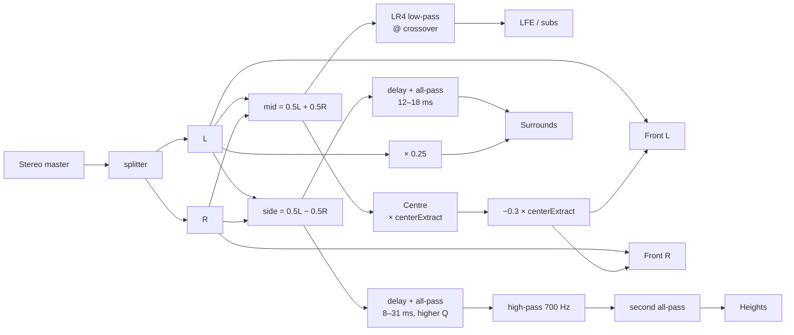

# Immersive audio

**Read this before delivering anything.**

Implementation: [`src/audio/immersive/`](../src/audio/immersive/)
Tests: [`tests/format/adm.test.js`](../tests/format/adm.test.js) (64) ·
[`tests/format/layouts.test.js`](../tests/format/layouts.test.js) (30) ·
[`tests/integration/graph.test.js`](../tests/integration/graph.test.js) (immersive section)

---

## What these exports are

Signal Rot renders your stereo master into a multichannel **channel bed** by synthesising
the additional channels. It is a creative up-mix, and it is good at being one.

## What these exports are not

| Claim                          | Reality                                                                                                                                                                                                                                                            |
| ------------------------------ | ------------------------------------------------------------------------------------------------------------------------------------------------------------------------------------------------------------------------------------------------------------------ |
| "Recovered height information" | **Stereo contains no height information.** The height channels carry decorrelated, high-passed ambience derived from the side signal. It sounds like space because decorrelated ambience above the listener sounds like space, not because anything was recovered. |
| "Object-based immersive audio" | Every channel is `typeDefinition="DirectSpeakers"` — a fixed loudspeaker bed. There are no audio objects, no positional automation, no object metadata.                                                                                                            |
| "A Dolby Atmos master"         | An Atmos deliverable (`.atmos` / IMF IAB / a DAMF set) is produced by licensed Dolby tooling from a session containing object metadata. An ADM BWF _can_ be an ingest format for those tools. It is not itself a certified master.                                 |
| "Head-tracked binaural"        | The binaural fold-down is fixed. Nothing moves when your head moves.                                                                                                                                                                                               |
| "Personalised HRTF"            | It uses the browser's built-in generic HRTF dataset. Your ears are not that dataset.                                                                                                                                                                               |
| "Validated against BS.2076"    | The XML is well-formed, ID cross-references resolve, UIDs are unique, chunk sizes and padding are correct — all asserted by 64 tests. It has **not** been validated against an official schema or ingested into a commercial renderer as part of CI.               |

## The honest taxonomy

| Category                              | Does Signal Rot do it?                                        |
| ------------------------------------- | ------------------------------------------------------------- |
| True object-based immersive authoring | **No**                                                        |
| Channel-bed export                    | **Yes** — this is what it does                                |
| Synthetic stereo up-mixing            | **Yes** — this is how the bed is made                         |
| Fixed binaural rendering              | **Yes**, via the browser's HRTF                               |
| Head-tracked binaural rendering       | **No**                                                        |
| ADM BWF metadata interoperability     | **Yes**, structurally — untested against commercial renderers |
| Platform-certified Atmos delivery     | **No**                                                        |

---

## Layouts

| Layout         | Channels | Standard mask | Notes                                                         |
| -------------- | -------- | ------------- | ------------------------------------------------------------- |
| 5.1            | 6        | ✓ `0x3F`      | BS.2051 System B. The safest channel-bed delivery.            |
| 7.1            | 8        | ✓ `0x63F`     | Side and rear surrounds as separate feeds.                    |
| 7.1.2          | 10       | ✓             | Common Atmos bed size. Height is synthesised.                 |
| 7.1.4          | 12       | ✓             | The standard Atmos home bed. Height is synthesised.           |
| 9.1.6          | 16       | ✗ mask 0      | Top-middle speakers have no `WAVEFORMATEXTENSIBLE` bit.       |
| Sonic Lab 20.4 | 24       | ✗ mask 0      | Venue-specific. See [`SONIC-LAB-20.4.md`](SONIC-LAB-20.4.md). |

### Channel ordering

`WAVE_FORMAT_EXTENSIBLE` defines interleave order as **ascending mask-bit order**, which is
not the same as the order a human would list the channels. 7.1 illustrates it:

```
layout order:  L  R  C  LFE  Lss  Rss  Lrs  Rrs
mask bits:     1  2  4   8   200  400   10   20     (hex)
WAV order:     L  R  C  LFE  Lrs  Rrs  Lss  Rss     ← sorted by bit
```

Layouts with no usable mask are written in layout order with `mask: 0`, which is what the
mask's absence means in practice. **Always deliver the channel map with those files.**

### The channel-mask bug this replaced

The pre-7.0 speaker table assigned:

| Channel                 | Assigned                      | Correct                      |
| ----------------------- | ----------------------------- | ---------------------------- |
| `Rtf` (top front right) | `0x2000` — `TOP_FRONT_CENTER` | `0x4000` — `TOP_FRONT_RIGHT` |
| `Rtr` (top back right)  | `0x10000` — `TOP_BACK_CENTER` | `0x20000` — `TOP_BACK_RIGHT` |

Because channel order is derived from those bits, every 7.1.2 and 7.1.4 file was
**mis-ordered as well as mis-labelled**. Asserted against the `ksmedia.h` values in
`tests/format/wav.test.js` and `tests/format/layouts.test.js`.

A second, quieter bug: `Lrs`/`Rrs` carried the ADM label `M+135` with an azimuth of ±150°,
so the metadata and the renderer disagreed by 15°. Both now read ±135°, per BS.2051.

---

## Coordinate conventions

Two conventions are in play. Confusing them is the easiest way to deliver a mirror-imaged
master, so they live in separate fields and are never inferred from one another.

| Field         | Convention                                               | Used by                |
| ------------- | -------------------------------------------------------- | ---------------------- |
| `azimuthAdm`  | **positive = LEFT**, 0 = front centre, range (−180, 180] | ADM XML, channel maps  |
| `azimuthHrtf` | **positive = RIGHT**                                     | Web Audio `PannerNode` |
| `elevation`   | **positive = UP**                                        | both                   |

`azimuthHrtf === −azimuthAdm` always, asserted for every speaker in the table.

Web Audio's `PannerNode` uses +X right, +Y up, −Z forward (the listener faces −Z), so:

```js
x = sin(azimuthHrtf) · cos(elevation)
y = sin(elevation)
z = −cos(azimuthHrtf) · cos(elevation)
```

---

## How the up-mix works



- **Centre** is matrix-derived: `C = mid × centerExtract`, with a compensating −0.3 dip on
  the front pair so extracting a centre does not leave the phantom image doubled.
- **Surrounds** carry the side signal, decorrelated by a delay (12–26 ms) and an all-pass,
  plus 25 % of the same-side direct signal for anchoring.
- **Heights** carry high-passed (700 Hz), more heavily decorrelated side content, through a
  second all-pass whose Q follows the decorrelation control.
- **LFE / subwoofers** are a 4th-order Linkwitz-Riley low-passed sum. Note this is a **bass
  management** feed, not a `+10 dB` LFE effects channel — the ADM declares it as low-passed
  and the channel map says so in words.

**Decorrelation** is delay plus all-pass. Cheap, phase-safe against the front pair at the
delays used (well past the Haas fusion window for the rear feeds), and it needs no impulse
response library. It is not a true decorrelation filter bank.

**Determinism.** Nothing here uses randomness, so an immersive render is reproducible
provided the upstream stereo master is — which the seeded character engines guarantee.

### Limiting a multichannel bed

`limitTruePeak()` is called with `lfeChannels` set, so the sub feeds are excluded from peak
_detection_ but still receive the gain. Without that, a kick in the LFE ducks the height
channels. The pre-7.0 build limited all channels with a fully linked detector.

---

## ADM BWF

### File structure

```
RIFF ---- WAVE
  bext   602 bytes, EBU Tech 3285 v2, with real loudness metadata
  fmt    40 bytes, WAVE_FORMAT_EXTENSIBLE
  chna   4 + 40·N bytes, channel allocation
  data   PCM, 24-bit by default
  axml   the ADM XML document
```

`chna` is written **before** `data` so a streaming parser can learn the routing without
seeking past the audio. `axml` follows, which is conventional because it is
variable-length. Both are padded to even lengths per the RIFF specification, with the pad
byte excluded from the chunk size.

### `bext` loudness fields

Populated from the actual analysis of the rendered bed, using BS.1770 channel weights
(LFE at G = 0, surrounds at G = 1.41). Signed 16-bit, units of 0.01 dB/LU:

| Offset | Field                  |
| ------ | ---------------------- |
| 346    | `Version` = 2          |
| 412    | `LoudnessValue`        |
| 414    | `LoudnessRange`        |
| 416    | `MaxTruePeakLevel`     |
| 418    | `MaxMomentaryLoudness` |
| 420    | `MaxShortTermLoudness` |

The pre-7.0 build left all of these zero despite having the data.

### Identifier scheme

BS.2076 reserves IDs below `0x1000` for the ITU common definitions; custom definitions must
use `0x1000` and above.

| Element                | Pattern                | Channel 1              |
| ---------------------- | ---------------------- | ---------------------- |
| `audioChannelFormatID` | `AC_0003xxxx`          | `AC_00031001`          |
| `audioBlockFormatID`   | `AB_0003xxxx_00000001` | `AB_00031001_00000001` |
| `audioStreamFormatID`  | `AS_0003xxxx`          | `AS_00031001`          |
| `audioTrackFormatID`   | `AT_0003xxxx_01`       | `AT_00031001_01`       |
| `audioTrackUID`        | `ATU_xxxxxxxx`         | `ATU_00000001`         |
| `audioPackFormatID`    | fixed                  | `AP_00031001`          |

`chna` entries are exactly 40 bytes: `trackIndex` (2) + UID (12) + `trackFormatIDRef` (14)

- `packFormatIDRef` (11) + pad (1). Those field widths are why the ID patterns are the
  lengths they are, and the tests assert both.

### What the tests verify

For **all six layouts**:

- RIFF container, `WAVE` form, declared size equals actual size minus 8
- All five chunks present, `chna` before `data`
- `bext` exactly 602 bytes with `Version` = 2 at offset 346
- `fmt ` is `WAVE_FORMAT_EXTENSIBLE` with the right channel count, rate and block align
- `data` size equals `frames × channels × bytes-per-sample`
- `chna` size equals `4 + 40 × channels`; every entry's index, UID and refs correct; UIDs unique
- Well-formed XML with balanced tags and no unescaped ampersands
- One `audioChannelFormat` / `audioStreamFormat` / `audioTrackFormat` / `audioTrackUID` /
  `audioBlockFormat` per channel
- **Every ID referenced is an ID that was declared** — full cross-reference resolution
- Azimuth and elevation in the XML match the speaker table, in the ADM convention
- LFE channels carry a `<frequency typeDefinition="lowPass">` element
- `DirectSpeakers`, never `Objects`
- Odd-length `axml` padded without inflating the declared size
- A hostile programme name is escaped rather than breaking the document
- Channel-count mismatch and unknown layouts throw rather than writing a corrupt file

### What is not verified

- Validation against an official BS.2076 XSD
- Ingest into the Dolby Atmos Renderer, the Sony 360 Reality Audio suite or an MPEG-H
  authoring tool
- Anything about how a renderer will _interpret_ a synthesised bed

---

## Binaural monitoring and fold-down

Each synthesised speaker feed is placed at its physical azimuth and elevation on a
`PannerNode` in `HRTF` mode, and the results are summed. That is a **fixed binaural render
of a virtual loudspeaker array** — the same thing you would get by putting a dummy head in
the room and not letting it move.

Sub feeds are summed without panning: they sit below the frequency range where HRTF cues
exist, so panning them adds nothing but comb filtering.

It is genuinely useful for checking that surround and height content _exists_ and is on the
correct side. It is not a substitute for the room, and it will sound different in Chromium
and Safari because the HRTF datasets differ.

---

## Channel identification export

Immersive → **Export channel identification file**.

A WAV that plays a distinct tone burst through each channel in turn with a silent gap
between. Sub channels get 55 Hz; everything else rises across the layout; the burst count
encodes the channel index in groups, so it is identifiable without watching a meter. Bursts
have 10 ms raised-cosine edges so they do not click.

Patch the file, press play, and you know within thirty seconds whether channel 17 is where
you think it is. For a 24-channel venue system that is the difference between a productive
afternoon and a wasted one.

---

## Delivery checklist

1. Export the **channel map** (`.txt` and `.json`) alongside the audio. Mandatory for
   9.1.6 and Sonic Lab, which have no standard mask.
2. Export the **channel identification file** and play it through the rig before trusting
   the routing.
3. Read the **render report**. It states the achieved loudness, the achieved true peak and
   whether the ceiling held.
4. If you are delivering to an Atmos workflow, say what the file is: a `DirectSpeakers`
   bed with synthesised height, not an object-based master.
5. Do not describe the height channels as recovered content.
