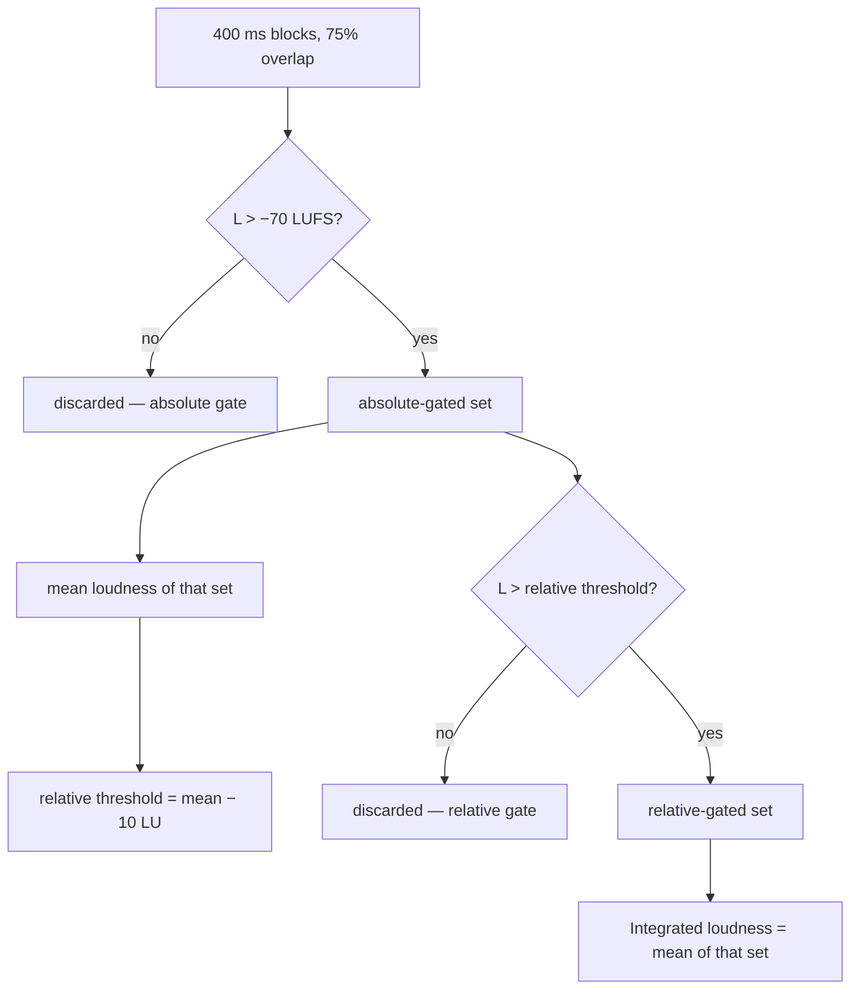

# Loudness analysis

Implementation: [`src/audio/analysis/loudness.js`](../src/audio/analysis/loudness.js)
Tests: [`tests/dsp/loudness.test.js`](../tests/dsp/loudness.test.js) — 32 tests

## Standards followed

| Standard        | What it specifies                                                      | Implemented               |
| --------------- | ---------------------------------------------------------------------- | ------------------------- |
| ITU-R BS.1770-4 | K-weighting, 400 ms blocks, channel weighting, two-stage gating        | yes                       |
| EBU R 128       | −23 LUFS target, −1 dBTP ceiling, LRA reporting                        | as defaults, not enforced |
| EBU Tech 3341   | Momentary (400 ms) and short-term (3 s) meters                         | yes                       |
| EBU Tech 3342   | Loudness range: 3 s blocks, −20 LU relative gate, 10th–95th percentile | yes                       |

## The compliance claim

**There is none.** The filter design reproduces the BS.1770-4 tables to machine precision
and the gating follows the specification, but the meter has **not** been validated against
the EBU Tech 3341 compliance material. That validation is on the roadmap and its results
will be published whether they pass or fail.

What _is_ claimed, and tested:

- The K-weighting coefficients at 48 kHz match BS.1770-4 Tables 1 and 2 to within 1e-12.
- A 1 kHz stereo sine reads its own amplitude in dBFS, to 0.1 LU.
- Mono reads exactly 3.01 LU below the same material in dual mono.
- The reading is independent of sample rate to 0.1 LU across 44.1 / 48 / 96 kHz.
- The reading scales exactly linearly with level.
- The gates behave as specified, including the cases where that produces a surprising
  answer.

## K-weighting

Two stages, cascaded.

### Stage 1 — high-frequency shelving filter

Models the acoustic effect of a head in a diffuse field. Roughly +4 dB above 2 kHz.

| Parameter | Value                |
| --------- | -------------------- |
| f₀        | 1681.974450955533 Hz |
| G         | 3.999843853973347 dB |
| Q         | 0.7071752369554196   |

**This is not an RBJ high-shelf.** RBJ parameterises shelf gain as `A = 10^(G/40)`;
BS.1770's shelf uses `Vh = 10^(G/20)` with a mid-band term
`Vb = Vh^0.4996667741545416`. Designing it as an RBJ shelf gets every coefficient wrong in
the third decimal place — a mistake this refactor made and the tests caught:

```
              RBJ shelf        BS.1770 Table 1
b0            1.52930494       1.53512486        Δ −5.8e-3
b1           −2.63612324      −2.69169619        Δ +5.6e-2
b2            1.15848487       1.19839281        Δ −4.0e-2
```

### Stage 2 — RLB high-pass filter

Revised low-frequency B-curve. Removes very low frequencies that contribute to measured
energy without contributing to perceived loudness.

| Parameter | Value                |
| --------- | -------------------- |
| f₀        | 38.13547087602444 Hz |
| Q         | 0.5003270373238773   |

**The numerator is `[1, −2, 1]`, not normalised for unity high-frequency gain.** The
tabulated filter has +0.0433 dB of pass-band gain, and that gain is baked into the
−0.691 dB offset. "Fixing" it biases every reading low by 0.043 dB.

### Coefficients at 48 kHz

Produced by `designKWeighting(48000)`, asserted against the published tables:

```
Stage 1 (shelf)                         Stage 2 (RLB)
b0  1.53512485958697                    b0   1.0
b1 −2.69169618940638                    b1  −2.0
b2  1.19839281085285                    b2   1.0
a1 −1.69065929318241                    a1  −1.99004745483398
a2  0.73248077421585                    a2   0.99007225036621
```

### Other sample rates

BS.1770-4 tabulates coefficients at 48 kHz only and is silent on other rates. The universal
practice — ffmpeg's `ebur128`, libebur128, pyloudnorm — is bilinear design at the working
rate using the parameters above, which is what this implementation does.

This is a **documented deviation from a specification that does not cover the case.** The
measured consequence is under 0.1 LU across 44.1 kHz to 192 kHz on the test signals.

## Block loudness

```
z_i  = (1/T) ∫ y_i²(t) dt          mean square of channel i over the block
L    = −0.691 + 10·log₁₀( Σ G_i · z_i )
```

- Block length **400 ms**, hop **100 ms** (75 % overlap), per Tech 3341 §2.1.
- `10·log₁₀` because `z` is a mean _square_ — a power, not an amplitude.
- The −0.691 dB offset aligns LKFS with the 0 LU reference.

### Channel weighting

| Channel                      | G    | Source                                                    |
| ---------------------------- | ---- | --------------------------------------------------------- |
| L, R, C                      | 1.0  | BS.1770-4 §3                                              |
| LFE                          | 0.0  | BS.1770-4 §3 — LFE is excluded                            |
| Ls, Rs, Lss, Rss, Lrs, Rrs   | 1.41 | BS.1770-4 §3                                              |
| Lw, Rw                       | 1.0  | assumption — wides are middle-layer front channels        |
| Ltf, Rtf, Ltm, Rtm, Ltr, Rtr | 1.0  | **assumption** — BS.1770-4 does not define height weights |

The height-channel weights are flagged in the source as an assumption, not a
specification. Immersive exports apply these weights when writing the `bext` loudness
fields.

## Gating

Two stages, per BS.1770-4 §5.3:



Means are taken in the **linear power domain**, not on the dB values. Comparisons use
strict inequality, as specified: a block exactly at the threshold is excluded.

If nothing survives the absolute gate, the result is `−Infinity` and `silent: true`. If the
programme is shorter than one 400 ms block, the result is `tooShort: true` — BS.1770 is
undefined there and the meter says so rather than inventing a number.

## Loudness range

Per EBU Tech 3342, which differs from the integrated measurement in three ways that are
easy to get wrong:

|               | Integrated            | Loudness range             |
| ------------- | --------------------- | -------------------------- |
| Block length  | 400 ms                | **3 s**                    |
| Hop           | 100 ms (75 % overlap) | **1 s**                    |
| Relative gate | −10 LU                | **−20 LU**                 |
| Statistic     | gated mean            | **95th − 10th percentile** |

The pre-7.0 implementation used 400 ms blocks with the −10 LU integrated gate, which reads
systematically high — momentary blocks have far more spread than short-term blocks.

Percentiles are linearly interpolated on the sorted gated set. Fewer than two surviving
blocks returns 0 rather than NaN.

### A result that looks wrong and is not

A programme whose two halves are 60 dB apart reports a **small** loudness range:

```
15 dB split → LRA 14.6 LU     ← as expected
60 dB split → LRA  3.3 LU     ← looks wrong, is correct
```

With a 60 dB split, the loud half dominates the absolute-gated mean, putting the relative
gate around −26 LUFS; the quiet half sits near −63 LUFS and is discarded entirely. What
remains is the loud half plus the transition, which genuinely does have a small range.
Loudness range measures the spread of the _programme material_, not the difference between
programme and near-silence. Asserted in the test suite so nobody "fixes" it.

## Test signals and expected values

All generated programmatically by [`tests/helpers/signals.js`](../tests/helpers/signals.js).

| Signal                             | Expected                    | Rationale                                                            |
| ---------------------------------- | --------------------------- | -------------------------------------------------------------------- |
| 1 kHz stereo sine, amplitude 1.0   | **0.0 LUFS**                | K-weighting at 1 kHz is ≈ +0.691 dB, cancelling the −0.691 dB offset |
| 1 kHz stereo sine, amplitude 0.1   | **−20.0 LUFS**              | same identity                                                        |
| 1 kHz stereo sine, amplitude 0.01  | **−40.0 LUFS**              | linear scaling                                                       |
| Same at 44.1 / 96 kHz              | within 0.1 LU               | rate independence                                                    |
| 1 kHz **mono** sine, amplitude 0.1 | −23.0 LUFS                  | one channel: 3.01 LU below dual mono                                 |
| Digital silence                    | `−Infinity`, `silent: true` | nothing above the absolute gate                                      |
| Programme < 400 ms                 | `tooShort: true`            | undefined in BS.1770                                                 |
| Empty buffer                       | `tooShort: true`            | no throw                                                             |
| Anti-phase stereo                  | identical to in-phase       | loudness sums per-channel mean squares; polarity is irrelevant       |
| Tone bursts, 50 % duty             | within 1.5 LU of continuous | the gate discards the silent blocks                                  |
| Pink noise, −6 dB                  | exactly −6.02 LU lower      | linearity                                                            |
| Full-scale square wave             | finite, > −5 LUFS           | no NaN on clipped material                                           |
| Sine at 1e-6 amplitude, 30 s       | finite                      | no denormal blow-up                                                  |
| LFE channel at G = 0               | no change to the reading    | channel weighting                                                    |
| Surround at G = 1.41               | +1.49 dB                    | `10·log₁₀(1.41)`                                                     |

## Performance

Cost is dominated by the two biquad passes per channel plus the mean-square accumulation.
Approximate, on a modern laptop:

| Programme              | Time    |
| ---------------------- | ------- |
| 3 min stereo, 44.1 kHz | ~250 ms |
| 3 min stereo, 96 kHz   | ~550 ms |
| 10 min stereo, 96 kHz  | ~1.9 s  |

This runs in a Web Worker with the channel data **transferred**, not copied, so the message
cost is a pointer swap. `createAnalysisScheduler()` gives it latest-wins semantics: dragging
a fader supersedes in-flight requests instead of queuing a dozen full-file analyses.

## Known deviations, in one place

1. **Not validated against EBU Tech 3341 compliance material.** No compliance claim.
2. **Coefficients designed at the working rate** rather than resampling to 48 kHz. Under
   0.1 LU on the test signals; the standard does not cover the case.
3. **Height-channel weights assumed at 1.0.** Not specified by BS.1770-4.
4. **The live momentary and short-term meters are not this implementation.** They are
   frame-driven approximations weighting the already-summed stereo bus, labelled as
   indicators in the UI. Every integrated figure comes from the offline pass.
5. **No true-peak in the loudness module.** True peak is a separate measurement; see
   [`TRUE-PEAK-LIMITER.md`](TRUE-PEAK-LIMITER.md).
