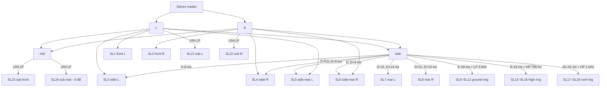

# Sonic Lab 20.4

**Anton Bruckner Privatuniversität, Linz — 24-channel periphonic loudspeaker system.**

Data: [`src/audio/immersive/sonic-lab.js`](../src/audio/immersive/sonic-lab.js)
Tests: [`tests/format/layouts.test.js`](../tests/format/layouts.test.js) — Sonic Lab section

This is the most unusual thing in Signal Rot and it is treated as a first-class subsystem
rather than an easter egg. It is a **real venue layout, not a standard**. No renderer knows
it by name. Everything a third party needs to interpret an export is in this document, in
the source data file, and in the channel map the application exports alongside the audio.

---

## The system

20 full-range loudspeakers on four rings, plus 4 subwoofers, arranged as a sphere around
the listening position.

| Ring           | Channels | Elevation | Character in the up-mix                                                                   |
| -------------- | -------- | --------- | ----------------------------------------------------------------------------------------- |
| **Ear**        | 1–8      | 0°        | The main listening plane. Direct front image, progressively decorrelated toward the rear. |
| **Ground**     | 9–12     | −8°       | Floor-level wash. Low-passed at 3 kHz, 6 dB below the ear ring.                           |
| **High**       | 13–16    | +13°      | Low height layer. High-passed at 700 Hz, decorrelated.                                    |
| **Roof**       | 17–20    | +33…35°   | Upper height layer. Airiest, deepest decorrelation.                                       |
| **Subwoofers** | 21–24    | −8°       | L / R / front / rear, through matched LR4 low-passes.                                     |

### The asymmetry is intentional

The azimuths are not mirror-symmetric: −30 / +27, −67 / +61, −112.5 / +115, −153 / +155.
These are the **surveyed positions of the physical loudspeakers** in a room that is not
perfectly symmetric. Tidying them into symmetry would be wrong and would mis-place the
image. A test asserts the asymmetry is preserved, so nobody "corrects" it.

---

## Coordinate conventions

Two conventions, kept in separate fields, never inferred from one another.

| Field         | Convention                                                                                                                                    |
| ------------- | --------------------------------------------------------------------------------------------------------------------------------------------- |
| `azimuthAdm`  | degrees, **positive = LEFT**, 0 = front centre, range (−180, 180]. ITU-R BS.2076. Written into the ADM XML and the channel map.               |
| `azimuthHrtf` | degrees, **positive = RIGHT**. Web Audio `PannerNode` +X axis. Drives the binaural monitor and the speaker-map display. Always `−azimuthAdm`. |
| `elevation`   | degrees, **positive = UP**. Both conventions.                                                                                                 |

Verified for every one of the 24 channels in the test suite.

---

## Channel map

```text
CH  ID     RING     AZ(ADM)  AZ(HRTF)   EL   TYPE   DESCRIPTION
--  -----  -------  -------  --------  ----  -----  -----------------------
 1  SL1    ear         30.0     -30.0     0  FULL   Front left
 2  SL2    ear        -27.0      27.0     0  FULL   Front right
 3  SL3    ear         67.0     -67.0     0  FULL   Wide left
 4  SL4    ear        -61.0      61.0     0  FULL   Wide right
 5  SL5    ear        112.5    -112.5     0  FULL   Side-rear left
 6  SL6    ear       -115.0     115.0     0  FULL   Side-rear right
 7  SL7    ear        153.0    -153.0     0  FULL   Rear left
 8  SL8    ear       -155.0     155.0     0  FULL   Rear right
 9  SL9    ground      43.5     -43.5    -8  FULL   Ground front left
10  SL10   ground     -40.0      40.0    -8  FULL   Ground front right
11  SL11   ground     134.0    -134.0    -8  FULL   Ground rear left
12  SL12   ground    -136.0     136.0    -8  FULL   Ground rear right
13  SL13   high        43.5     -43.5    13  FULL   High front left
14  SL14   high       -40.0      40.0    13  FULL   High front right
15  SL15   high       134.0    -134.0    13  FULL   High rear left
16  SL16   high      -136.0     136.0    13  FULL   High rear right
17  SL17   roof        44.0     -44.0    33  FULL   Roof front left
18  SL18   roof       -41.5      41.5    35  FULL   Roof front right
19  SL19   roof       131.0    -131.0    34  FULL   Roof rear left
20  SL20   roof      -130.0     130.0    35  FULL   Roof rear right
21  SL21   sub         90.0     -90.0    -8  SUB    Subwoofer left
22  SL22   sub        -90.0      90.0    -8  SUB    Subwoofer right
23  SL23   sub          0.0       0.0    -8  SUB    Subwoofer front
24  SL24   sub        180.0    -180.0    -8  SUB    Subwoofer rear
```

Exportable from the application: **Immersive → Channel map (.txt)** and
**Channel map (.json)**. The JSON form is machine-readable and includes the conventions
block, so a receiving system can interpret it without this document.

---

## Speaker labels in ADM

BS.2076 allows custom speaker labels. Sonic Lab's are namespaced so nobody can mistake them
for ITU labels:

```
SIGNALROT_SL_01 … SIGNALROT_SL_20
SIGNALROT_SL_SUB_L · SIGNALROT_SL_SUB_R · SIGNALROT_SL_SUB_F · SIGNALROT_SL_SUB_B
```

A test asserts that none of them matches the BS.2051 label pattern (`M+030`, `U-045` and so
on), because a label that _looks_ standard but is not is worse than one that obviously is
not.

The pack is declared `typeDefinition="DirectSpeakers"` with a custom
`audioPackFormatID` in the `0x1000+` custom range. That is the correct ADM construction for
a non-standard loudspeaker layout.

---

## How the up-mix uses the rings



**Ear ring.** Channels 1 and 2 take L and R directly. Channels 3 and 4 take the same-side
direct signal at 0.72 plus 45 % of a 5–6 ms decorrelated side signal. Channels 5–8 are
progressively later and more decorrelated, so the image opens toward the rear rather than
snapping.

**Ground ring.** Low-passed at 3 kHz and 6 dB below the surround level. A floor wash needs
to be felt, not localised.

**High and roof rings.** High-passed side content with a second all-pass whose Q follows the
decorrelation control. The roof ring is the airiest and most delayed. **None of this is
recovered height information** — stereo has none.

**Subwoofers.** All four derive through **identical** 4th-order Linkwitz-Riley low-passes,
so they stay phase-coherent with each other. SL21 and SL22 carry L- and R-weighted bass at
0.85; SL23 carries the mono anchor at unity; SL24 carries the same mono content at 0.7.

These are **bass-management feeds**, not an LFE effects channel. They carry the low band of
the programme, not a separate +10 dB feed. The ADM marks them low-passed and the channel
map says so in words.

---

## Delivery

1. **Export the channel map.** A 24-channel file with `mask: 0` is uninterpretable without
   it. Both `.txt` (for a human at a patchbay) and `.json` (for a receiving system).
2. **Export the channel identification file.** Tone bursts through each channel in turn,
   one at a time, with silence between. Subs get 55 Hz; the rest rise across the layout.
   Play it through the rig before trusting anything.
3. **Choose a delivery format.** Multichannel WAV is the safe option. ADM BWF carries the
   speaker positions in metadata but no standard renderer knows what `SIGNALROT_SL_07` is
   — the map is still required.
4. **Read the render report.** Achieved loudness, achieved true peak, ceiling compliance.

## File naming

Exports use `SonicLab20.4` rather than the internal `soniclab` identifier:

```
<source>_SonicLab20.4.wav                              multichannel bed
<source>_SonicLab20.4_ADM.wav                          ADM BWF
<source>_SonicLab20.4_binaural.wav                     binaural fold-down
signal-rot_SonicLab20.4_channel-map.txt
signal-rot_SonicLab20.4_channel-map.json
signal-rot_SonicLab20.4_channel-identification.wav
```

## Attribution

The Sonic Lab is an installation at the Anton Bruckner Privatuniversität, Linz. This layout
is included as technical data. There is no claim of affiliation with, or endorsement by,
the university.
