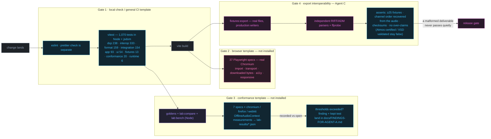

# Testing

```bash
npm run test             # 1,070 tests in Node + jsdom; duration is runner-reported
npm run test:watch
npm run test:coverage
npm run test:e2e         # 37 Playwright specs — npx playwright install chromium first
npm run test:conformance # 7 real-browser measurement specs × chromium/firefox/webkit
npm run validate:exports # independent parsers + ffprobe over production output
npm run check            # lint + test + export validation + build
```

Counts above are the measured reality at this commit and appear verbatim in the diagrams
below; `npm run test` prints the live totals. Domain colours used here and in every diagram
are the seven from [COLOR-SYSTEM.md](COLOR-SYSTEM.md).

## Philosophy

**Test the claim, not the implementation.** Signal Rot makes specific, checkable
assertions — "reproduces the BS.1770-4 coefficients", "the crossover sums flat at every mix
position", "the ceiling is respected". Each of those has a test that would fail if the claim
stopped being true. A test that only asserts a function returns the number it currently
returns proves nothing.

Three rules follow:

1. **Every test signal is generated programmatically.** No copyrighted audio in the
   repository, and every result reproducible on any machine.
2. **Verification is independent of production.** The format tests parse files with a
   separate RIFF/IFF reader in `tests/helpers/riff.js`. If the writer and the reader shared
   code, a passing test would prove only that they agree.
3. **Regressions get a test that reproduces the original failure.** The analytical
   crossover suite models both the old partial-mix null and the ideal flat sum. That is
   not a browser measurement: [finding A-6](FINDINGS-FOR-AGENT-A.md#measured-in-a-real-browser)
   still fails the real wet-path reconstruction test. Keep both guardrails.

## Layout

```
tests/
├── helpers/
│   ├── signals.js              synthetic test signals
│   ├── riff.js                 independent RIFF / IFF / chna / axml parsers
│   ├── fake-audio-context.js   recording Web Audio implementation
│   └── fake-canvas.js          no-op 2D context for jsdom
├── dsp/              238 tests ● DSP      math · biquad · prng · loudness · true-peak · limiter ·
│                                          transient · dither · crossover · correlation · match
├── format/           159 tests ● EXPORT   wav · aiff · adm · layouts · download
├── interoperability/ 333 tests ● EXPORT   independent round-trips · hostile metadata · delivery
├── app/               93 tests ● APP      parameters · state · presets-io · presets-catalog ·
│                                          visual-system (the colour/diagram guard)
├── integration/      154 tests ● DSP      graph topology (126) · full post-render pipeline (28)
├── runtime/            6 tests ● RUNTIME  scheduler · rpc · memory plan · pyramid · stream
├── fixtures/          13 tests ● DSP      golden bank snapshots
├── conformance/       20 tests ● TESTING  lab classification + immersive catalog fixtures
└── ui/                54 tests ● UI       controls · tabs · signal-flow · presets · boot · UX
e2e/                 37 specs   ● TESTING  Playwright · import · controls · export · responsive · a11y
tests/browser/        7 specs   ● TESTING  OfflineAudioContext conformance lab (3 engines)
```

## Test signals

[`tests/helpers/signals.js`](../tests/helpers/signals.js):

| Generator           | Purpose                                                               |
| ------------------- | --------------------------------------------------------------------- |
| `sine`              | Level and frequency accuracy against analytically known answers       |
| `fadedSine`         | Same, with raised-cosine edges so interpolators do not ring on a step |
| `silence`           | Gate behaviour, division by zero, NaN                                 |
| `whiteNoise`        | Seeded Gaussian; decorrelation and crest factor                       |
| `pinkNoise`         | Voss-McCartney −3 dB/octave; the standard broadband loudness signal   |
| `toneBursts`        | 50 % duty cycle; exercises the absolute and relative gates            |
| `antiPhase`         | Correlation −1; mono cancellation                                     |
| `transientTrain`    | Sharp transients on a quiet bed; the hard case for a limiter          |
| `twoLevelProgramme` | Configurable dynamic range; loudness range and relative gating        |
| `extremeDynamics`   | 60 dB split; the case where correct gating looks like a bug           |
| `toDualMono`        | Mono → stereo, for the 3.01 LU identity                               |

## The fake audio context

[`tests/helpers/fake-audio-context.js`](../tests/helpers/fake-audio-context.js) implements
the Web Audio _node_ API without processing audio. It records topology and parameter
values, which lets `graph.test.js` (126 tests) assert things a browser test could not easily reach:

- Every declared speaker feed exists and is connected to the source, for all six layouts
- Bypass really neutralises a module, and only that module
- Every catalogue preset applies without producing a non-finite parameter
- Exactly one monitoring path is unmuted at a time
- Every generator is started once and stopped on dispose — no leaked oscillators
- The saturation make-up gain lives on its own node, separate from the chain output

It throws on unimplemented calls rather than silently doing nothing, so a test cannot pass
because the fake was too forgiving.

## What each suite proves

### `tests/dsp/loudness.test.js`

- K-weighting stage 1 and stage 2 match BS.1770-4 Tables 1 and 2 to **1e-12**
- The RLB numerator stays `[1, −2, 1]` at every rate — its +0.043 dB pass-band gain is part
  of the standard
- Both stages are stable (poles inside the unit circle) at 44.1 … 192 kHz
- A 1 kHz stereo sine reads its amplitude in dBFS: 1.0 → 0.0 LUFS, 0.1 → −20.0, 0.01 → −40.0
- Mono reads exactly 3.01 LU below dual mono
- Rate independence to 0.1 LU; exact linearity with level
- Silence → `−Infinity` and `silent`; under 400 ms → `tooShort`; empty buffer → no throw
- Anti-phase measures identically to in-phase
- 400 ms blocks at 75 % overlap produce exactly the expected count
- Absolute gate at −70, relative gate at −10 LU on the gated mean
- Loudness range: 14.6 LU measured on a 15 LU programme; correctly small on a 60 dB split
- Channel weighting: LFE at G = 0 changes nothing; surrounds at 1.41 add 1.49 dB
- No NaN on 30 s of 1e-6 amplitude, or on a full-scale square wave

### `tests/dsp/true-peak.test.js`

- The polyphase bank has `factor` branches of unity DC gain, and is memoised
- fs/4 worst case: **−0.168 dB** versus cubic's **−1.072 dB**
- Never reads below the sample peak, at any frequency
- Reads a low-frequency sine and interior DC exactly
- Detects +1.9 dBTP of overshoot on a clipped square wave that a sample meter calls 0 dBFS
- The real-time estimate stays within 0.5 dB and never under-reads the sample peak

### `tests/dsp/limiter.test.js`

- The sliding minimum is correct, including its window edges, and never exceeds the source
- Hann smoothing preserves a constant and removes a step's discontinuity
- The gain curve never exceeds the required gain at any sample
- Maximum sample-to-sample gain change **< 0.02** — the pre-7.0 curve stepped
- Reduction begins _before_ the transient arrives
- The ceiling holds at −0.1, −0.3, −1.0 and −2.0 dBTP on transients, bass-heavy material and
  already-clipped input
- One gain curve for all channels — the L/R ratio is preserved sample by sample
- LFE channels are excluded from detection but still gained
- Material below the ceiling comes out **bit-identical**

### `tests/dsp/multiband-crossover.test.js` — 15

- The ideal-filter model sums to **< 0.001 dB** at nine mix positions, four sample rates
  and four crossover-frequency pairs; the browser wet-sum contract remains open (A-6)
- Each band lands where it belongs and is −6.02 dB at its crossover
- The pre-7.0 topology is reproduced and shown to null by 25–59 dB at partial mix
- The amount→threshold/ratio mapping is monotonic and clamps

### `tests/dsp/dither.test.js`

- TPDF adds at most ±1 LSB and has a triangular, not rectangular, density
- Shaped dither puts **less** error energy below 4 kHz than flat TPDF
  (this test caught a sign error in the error-feedback filter)
- Dither is refused for 32-bit float, with a reason
- Channels get independent streams — dither must not sit dead centre
- Deterministic for a seed, different for a different seed
- Quantisation error is measurably less correlated with the signal than without dither

### `tests/dsp/transient-shaper.test.js`

- The gain trajectory is **identical 20 dB down** — the level-independence claim
- One gain for all channels
- Positive attack raises the sample peak, negative lowers it
- A steady 2 kHz tone is left alone to within 0.02
- Bounded to ±12 dB; no NaN on silence

### `tests/format/` — 159

WAV: header fields, `WAVE_FORMAT_IEEE_FLOAT`, 24-bit packing, exact float round-trip,
half-LSB 16-bit round-trip, channel interleave order, extensible fields and GUID tail,
every `SPEAKER_*` mask value, odd-length padding, size guards.

AIFF: the canonical 80-bit extended byte sequences for 44.1 and 48 kHz, round-trip for ten
rates, big-endian samples, two's-complement negatives, odd-length `SSND` padding.

ADM: 64 tests across **all six layouts** — chunk presence and order, `bext` size and
version, `chna` entry widths and uniqueness, full ID cross-reference resolution, well-formed
XML, azimuth convention, LFE `lowPass` elements, `DirectSpeakers` not `Objects`, XML escaping
of hostile input, refusal on channel-count mismatch.

Layouts: `azimuthHrtf === −azimuthAdm` for every speaker, BS.2051 labels matching their
azimuths, the corrected height mask bits, WAV channel ordering by mask bit, Sonic Lab's ring
structure and preserved asymmetry, channel-map export.

Download: path traversal, Windows-forbidden characters, control characters, reserved device
names, HTML-injection filenames, truncation preserving the extension, unicode preservation.

### Additional merged guardrails

- `tests/dsp/saturation.test.js`: +12 dB structural headroom and unity small-signal gain.
- `tests/dsp/dynamics-compressor-makeup.test.js`: inverse fixed compressor make-up;
  `tests/integration/graph.test.js` checks the separate compensation nodes and dry delay.
- `tests/dsp/source-aware.test.js`, `tests/dsp/mastering-guardrails.test.js` and
  `tests/app/preset-families.test.js`: down-only adaptation, loudness restraint and no
  degradation DSP in mastering presets.
- `tests/interoperability/`: hostile metadata, independent round trips and honest
  delivery claims. `npm run validate:exports` separately exercises ffprobe and channel ID.
- `tests/runtime/runtime.test.js`: opt-in infrastructure contracts, not proof that the
  existing render/analysis paths have migrated. See [runtime contracts](../src/runtime/README.md).
- `tests/ui/boot.test.js`: a click on either loudness-match control toggles state once;
  the real bootstrap exposes duplicate event wiring that isolated component tests miss.
- `tests/fixtures/` and `tests/conformance/`: golden audio and comparison rules;
  [the browser lab](CONFORMANCE.md) verifies real nodes independently of fake topology.

### `tests/app/` — 93

Schema integrity (every parameter complete, defaults in range, divergences explained),
clamping, hostile input, prototype pollution, preset round-trip, migration from a realistic
pre-7.0 file, the nine enforced catalogue safety rules, store subscriptions, undo/redo
bounds, deterministic reset.

### `tests/integration/` — 154

`graph.test.js` (126) — topology, parameter application, bypass semantics, every catalogue
preset against a real graph, immersive feeds and binaural placement.

`render-pipeline.test.js` (28) — the whole post-render pipeline: convergence to −14, −18 and
−23 LUFS within 0.25 LU; honest reporting of the unreachable −9 LUFS target; the ceiling
held at four values × two targets, re-verified independently; **bit-identical output for the
same seed**; duration, rate and channel count preserved through WAV and AIFF; the ceiling
surviving 16-bit quantisation; the render report's completeness and JSON-safety.

### `tests/ui/` — 54

`controls.test.js` (30) — `el()` never produces HTML from dynamic values; the ARIA tab
pattern including arrow/Home/End and roving tabindex; schema-driven control rendering,
label association, `aria-valuetext`, badges, cross-parameter disabling; the signal-flow view;
the preset panel.

`boot.test.js` — **loads the real `index.html`**, stubs Web Audio and canvas, runs
`bootstrap()`, and asserts: no console errors, every schema parameter has a control, the
signal-flow view renders, all catalogue presets render, the immersive menu populates, the About
panel fills from live probing, an animation frame runs without throwing, a preset applies end
to end through the real DOM, the transport buttons are wired, no duplicate element ids, and
every `aria-controls` and `label[for]` resolves.

That last suite is the cheapest possible answer to "does the application actually start?" —
the question the audited repository answered with **no**, because `index.html` pointed at
`./src/app.js` while the file sat at the repository root.

### `e2e/`

Real Chromium, real Web Audio, real downloads.

- Import a synthesised WAV, decode it, analyse it, read the LUFS off the meter
- Play, pause, seek
- Reject an undecodable file with a specific message
- A hostile filename does not execute
- Keyboard tab navigation; slider readouts; export-only badges
- Apply a preset and verify the resulting control values
- Undo/redo; theme persistence across reload; A/B and monitor switching
- Module bypass from the signal-flow view; the command palette
- Phase warnings appear for a destructive preset
- **Export a WAV and parse the downloaded bytes**: RIFF magic, declared size, channel count,
  sample rate, bit depth
- Export reports achieved LUFS and dBTP; download and parse the JSON render report
- Save a preset, reset, reload it, verify the value came back
- Export a 5.1 file and check `WAVE_FORMAT_EXTENSIBLE` and the `0x3F` mask
- Mobile layout: single-column grids, scrollable tabs, no horizontal overflow, touch targets
- Accessibility: skip link first in the tab order, every button named, every control
  labelled, visible focus rings, live regions, `Space` not swallowed, reduced-motion honoured

> UI browser tests were not executed during the 7.0 refactor. Do not infer a pass from
> Vitest or the export CI check. General CI and conformance workflows remain uninstalled
> templates; see [CI status](../ci/README.md) and [recorded browser findings](FINDINGS-FOR-AGENT-A.md).

## The pipeline

Four validation routes are shown below. Only export interoperability (Gate 4) is active
CI; general CI, UI browser and conformance jobs remain templates in `ci/`. Gate 1 runs
locally via `npm run check`, with formatting checked separately. The colours mark domain
ownership ([WORKSTREAMS.md](WORKSTREAMS.md)); they do not imply a gate is installed.



### Suite sizes, in numbers

```text
tests/interoperability   333  ██████████████████████████████████████████████
tests/dsp                238  ██████████████████████████████
tests/format             159  ████████████████████
tests/integration        154  ███████████████████
tests/app                 93  ████████████
tests/ui                  54  ███████
e2e (Playwright specs)    37  █████
tests/conformance         20  ███
tests/fixtures            13  ██
tests/runtime              6  █
tests/browser (lab specs)  7  █        1 █ = 8 tests · vitest totals measured 2026-09-07
```

## Coverage

```bash
npm run test:coverage
```

`src/main.js`, `src/app/bootstrap.js` and the worker entry point are excluded — they are
wiring, covered by the boot smoke test and the e2e suite rather than by unit tests.

## Adding a test

1. Put pure DSP in `tests/dsp/` and assert against an **analytically known** value where
   one exists. `expect(x).toBe(whatItCurrentlyReturns)` is not a test.
2. Put format work in `tests/format/` and parse the output with `tests/helpers/riff.js`,
   not with the writer's own code.
3. If you are fixing a bug, add the test that reproduces it **first**, and keep the
   reproduction of the old behaviour if it is cheap to express.
4. If you are changing what a render sounds like, add a measurement to
   `tests/integration/render-pipeline.test.js` and put the before/after numbers in the PR.
5. If you are changing domain colours, diagram classDefs or the repo map, nothing to do —
   `tests/app/visual-system.test.js` reads the spec, the tokens and every diagram, and
   fails if any of them drift ([COLOR-SYSTEM.md](COLOR-SYSTEM.md)).
