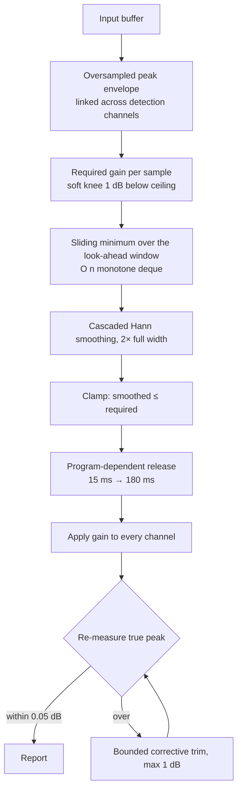

# True peak and limiting

Implementation:
[`src/audio/analysis/true-peak.js`](../src/audio/analysis/true-peak.js) ·
[`src/audio/render/limiter.js`](../src/audio/render/limiter.js) ·
[`src/audio/render/normalize.js`](../src/audio/render/normalize.js)

Tests: [`tests/dsp/true-peak.test.js`](../tests/dsp/true-peak.test.js) (13) ·
[`tests/dsp/limiter.test.js`](../tests/dsp/limiter.test.js) (20) ·
[`tests/integration/render-pipeline.test.js`](../tests/integration/render-pipeline.test.js) (25)

---

## Why sample peak is not enough

A digital sample stream is a set of points on a band-limited waveform. The waveform between
the samples can — and routinely does — exceed the largest sample. A DAC, a sample-rate
converter or a lossy codec reconstructs that waveform and clips it.

The canonical demonstration is a sine at exactly `fs/4` sampled at ±45°: every sample sits
at 0.7071 (−3.01 dBFS) while the waveform reaches 1.0 (0 dBTP). A sample-peak meter reads
−3 dBFS and calls it safe with 3 dB to spare.

## The interpolator

A **windowed-sinc polyphase interpolator**: 12 taps per phase, Kaiser window β = 8.6.

| Source rate | Factor | Effective rate     |
| ----------- | ------ | ------------------ |
| < 88.2 kHz  | 4×     | 176.4 / 192 kHz    |
| < 176.4 kHz | 2×     | 176.4 / 192 kHz    |
| ≥ 176.4 kHz | 1×     | already sufficient |

Phase 0 is the identity delay, so original samples are reproduced exactly and only the
intermediate points are computed. Each phase is normalised to unity DC gain so a constant
input is reproduced exactly.

Samples outside the buffer are treated as **silence**. That is the correct model — the file
is preceded and followed by nothing — and it avoids the step discontinuity that clamping to
the endpoint would invent, which rings and over-reads at high frequencies. A hard-edged
block (constant DC with no fade) therefore reads the genuine reconstruction overshoot at
its own discontinuity, which is correct behaviour rather than an artefact.

### Deviation from BS.1770-4 Annex 2

Annex 2 tabulates one specific 48-tap, 4-phase FIR for the 48 kHz case. This module does
not use it. The deviation is deliberate: a parameterised design generalises to any
oversampling factor and any source rate, which the tabulated filter does not.

### Measured accuracy

At 48 kHz, 4×, against analytically known answers:

| Test signal                            | this module        | cubic (pre-7.0) | true value |
| -------------------------------------- | ------------------ | --------------- | ---------- |
| Sine at `fs/4`, sampled at ±45°        | **−0.168 dB**      | **−1.072 dB**   | 0.0 dBTP   |
| Sines 1–23 kHz × 12 phases, worst case | +0.0002 dB         | −1.072 dB       | 0.0 dBTP   |
| DC (interior)                          | exact              | exact           | —          |
| Clipped square wave                    | +1.9 dBTP detected | under-reads     | > 0 dBTP   |
| Silence                                | 0                  | 0               | 0          |

The `fs/4` row is the one that matters: the pre-7.0 cubic interpolator missed it by more
than a decibel, so setting the ceiling to −0.1 dBTP could deliver a file reaching
+0.97 dBTP after reconstruction.

The residual −0.17 dB is **not** a design defect. The sinc series for that particular
signal has 1/n tails and converges too slowly for any short FIR; lengthening the filter to
32 taps per phase changes the reading by under 0.001 dB. A real limiter therefore still
needs a small safety allowance, which the verification pass provides.

### Real-time estimate

The full polyphase pass is far too expensive for a 60 fps animation frame.
`truePeakEstimate()` uses the same filter with 8 taps and a stride, which under-reads
slightly on very short transients. **The live meter is labelled "est." for exactly this
reason.** The export path always uses the full measurement.

---

## The limiter

Gain-computer → gain-smoother → applier, operating on the whole buffer offline.



### 1. Detection

The required gain is computed from an **oversampled, band-limited reconstruction**, not
from the sample values. Detection is stereo- and multichannel-**linked**: one gain curve for
all channels, so the stereo image never moves. Verified sample-by-sample in the test suite
by checking that the L/R ratio is preserved.

`lfeChannels` are excluded from _detection_ so a kick in the sub does not duck the height
channels, but they are still _gained_ by the same curve — otherwise the bed would come
apart.

### 2. Soft knee

Gain reduction begins 1 dB below the ceiling and eases in with a smoothstep, so the limiter
is already moving when the transient arrives instead of slamming shut. This is the single
biggest difference between transparent and crunchy limiting.

### 3. Look-ahead — the part the pre-7.0 build got wrong

The old implementation took a forward minimum of the required gain and applied it directly:

```js
if (target < g) {
  g = target;
} // ← a step
```

A step in the gain signal is a multiplication by a step function: broadband splatter on
every transient. "Look-ahead" told it _when_ to duck but not _how_ to get there.

Here the sliding minimum is convolved with a **cascade of two full-width Hann windows**
(the minimum window is widened to 2× the look-ahead to match the cascade's support). The
cascaded kernel is near-Gaussian: its spectral sidelobes sit around −62 dB where a single
Hann's sit at −31 dB, and on a transient notch the peak gain slope falls by 25 % and the
peak curvature by 46 % — less modulation-distortion splatter for the same depth. Because
the minimum is taken over a window at least as wide as the smoothing kernel, the smoothed
curve is provably ≤ the required gain at every sample: the reduction is anticipated,
continuous and sufficient. This is the classic "smoothed minimum" construction.

Measured, on a transient train at 3× full scale:

|                 | maximum sample-to-sample gain change |
| --------------- | ------------------------------------ |
| pre-7.0 stepped | the full reduction in one sample     |
| current         | **< 0.02**                           |

The sliding minimum uses the ascending-minima (monotone deque) algorithm — O(n), not
O(n · window).

### 4. Program-dependent release

An asymmetric one-pole after the smoother: fast (15 ms) immediately after an attack,
blending to slow (180 ms) over 50 ms of sustained reduction. That is what stops a dense mix
from pumping. The release stage can only _lower_ the gain relative to the smoothed curve,
never raise it, so it cannot reintroduce overs.

### 5. Verification — overs are never hidden

After limiting, the buffer is re-measured with the full `analysePeaks()`. If the ceiling is
still exceeded by more than 0.05 dB, a **bounded** corrective trim is applied (maximum 1 dB)
and the result re-measured. If more than 1 dB would be needed, something is structurally
wrong and silently attenuating the master is not the right answer — the report says
`ceilingRespected: false` and the export notice turns into a warning.

### Oversampled detection versus oversampled processing

This limiter oversamples **detection only**. The gain is applied at the base rate, which is
correct — a gain signal with content above Nyquist would alias. The consequence is that the
limiter cannot fix an inter-sample peak sitting between two samples that are themselves far
below the ceiling; it reduces the surrounding region instead. That is how every
non-clipping true-peak limiter works, and it is why the safety allowance exists.

### Measured behaviour

`tests/dsp/limiter.test.js` asserts the ceiling holds on:

- Sharp electronic transients at 2.2× full scale, at ceilings −0.1, −0.3, −1.0 and −2.0 dBTP
- Bass-heavy material (45 Hz at 1.4× full scale)
- Already-clipped input (a full-scale square wave)
- Silence, without dividing by zero
- Material already below the ceiling — **bit-identical output, zero gain reduction**

---

## Normalisation convergence

Normalise-then-limit does not deliver the target: limiting removes energy, so the finished
master lands below the number the user asked for — by 0.1 dB on gentle material and by well
over 1 dB on dense material at −9 LUFS. The pre-7.0 build did exactly this and never
checked.

### The iteration

```
measure → apply gain → limit → re-measure → correct → repeat
```

A naive correction — "add the shortfall to the gain" — does not converge, because the
limiter is compressive: adding 1 dB of input gain raises delivered loudness by less than
1 dB. This implementation estimates the local slope `dLoudness/dGain` from the previous two
passes (a secant step) and corrects by `shortfall / slope`, with 0.6 as a conservative first
guess. Bounded to five passes; the best result seen is kept if a late pass diverges.

Measured on pink noise, ±0.25 LU or better:

| Target   | Achieved | Passes |
| -------- | -------- | ------ |
| −14 LUFS | −14.0    | 2      |
| −18 LUFS | −18.0    | 2      |
| −23 LUFS | −23.0    | 2      |

Batch export uses `refine: false` — a single pass — trading the last 0.2 LU for speed.

### Targets that cannot be reached

A transparent look-ahead limiter has a hard loudness ceiling set by the material's crest
factor. Past that point, extra input gain is met with exactly as much gain reduction and
delivered loudness stops moving. Measured on pink noise at a −1 dBTP ceiling:

```
+10 dB → −16.61 LUFS
+14 dB → −12.64 LUFS
+18 dB → −10.18 LUFS
+22 dB →  −9.80 LUFS
+26 dB →  −9.80 LUFS   ← saturated
+30 dB →  −9.80 LUFS
```

Signal Rot does not secretly insert a clipper to get past this. It detects the plateau (two
passes producing the same loudness for different gains), stops iterating, sets
`targetReachable: false`, and the render report says:

> The −9 LUFS target is not reachable on this material at a −1 dBTP ceiling: the limiter
> saturated at −9.8 LUFS (−0.8 LU short). Beyond this point more gain produces only more
> gain reduction. Getting louder needs clipping, a lower ceiling, or a denser mix.

That is the honest answer, and it is more useful than a number that quietly missed.

---

## What the report tells you

Every export produces a downloadable JSON report. The limiter section:

```json
{
  "limiter": {
    "ceilingDbtp": -1,
    "maximumGainReductionDb": -4.82,
    "averageGainReductionDb": -0.91,
    "reducedSampleRatio": 0.3417,
    "achievedTruePeakDbtp": -1.0,
    "correctionTrimDb": 0,
    "ceilingRespected": true
  },
  "loudness": {
    "targetLufs": -14,
    "normalizationGainDb": 11.9,
    "achievedLufs": -14.01,
    "deltaLu": -0.01,
    "refinementPasses": 2,
    "targetReachable": true
  }
}
```

`achievedTruePeakDbtp` is **measured on the finished buffer**, not predicted.

## Known limitations

1. **Not a certified true-peak meter.** Not validated against EBU Tech 3341 material.
2. **Not the Annex 2 filter.** A documented, measured deviation.
3. **The live meter is an estimate**, strided for speed and labelled as such.
4. **Detection is oversampled; processing is not.** Inherent to non-clipping limiting.
5. **No inter-sample clipping mode.** Getting past the loudness plateau needs clipping,
   which this project does not offer. That is a deliberate omission, not an oversight.
6. **Ceiling compliance after lossy encoding is not verified.** An MP3 or AAC decoder can
   overshoot its encoder input by around 1 dB, which is why the default ceiling is
   −1.0 dBTP and why no preset uses anything hotter.
7. **Ceiling compliance after resampling is not verified.** Converting the delivered file
   to another rate outside Signal Rot can raise its true peak. Export at the delivery rate.
