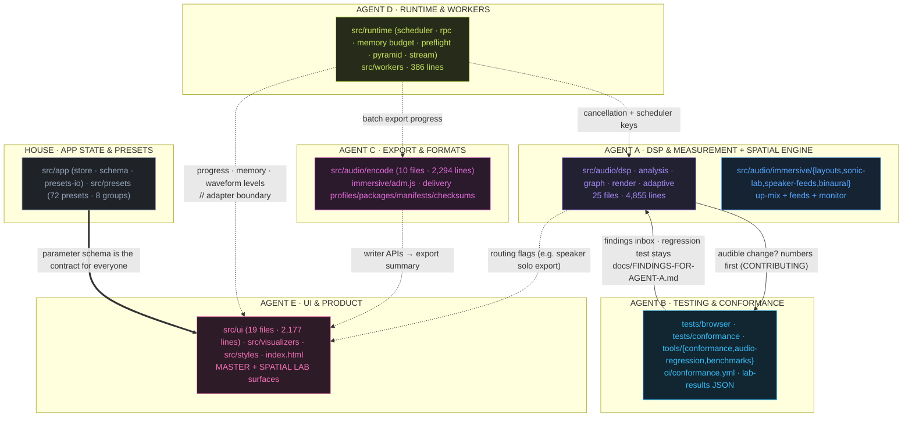
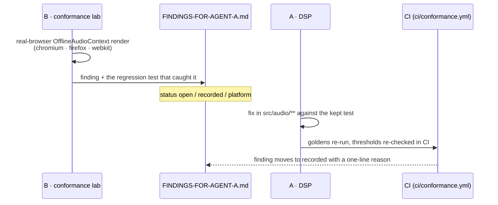
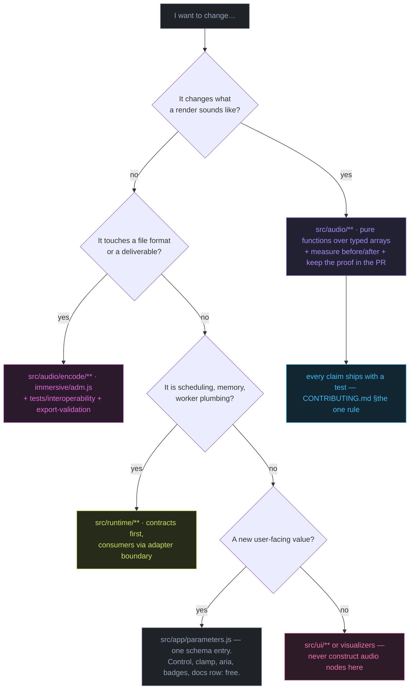

# Workstreams & ownership

Signal Rot is developed as five parallel workstreams, each owned by a named agent, each
colour-coded by its domain from [COLOR-SYSTEM.md](COLOR-SYSTEM.md). This document is the
single map of **who owns which ground, what crosses the seams, and what the handoff rules
are.** It reflects the real arrangement recorded across
[CONTRIBUTING.md](../CONTRIBUTING.md),
[PRODUCT-EXPERIENCE.md](PRODUCT-EXPERIENCE.md),
[FINDINGS-FOR-AGENT-A.md](FINDINGS-FOR-AGENT-A.md) and
[runtime contracts](../src/runtime/README.md) — it is not an aspiration.

## Ownership map

Colour means _domain_, the subgraph title means _owner_. Where one agent spans two
domains (A), both swatches appear.

## Who owns what, concretely

| Agent | Domains                                                | Owns (primary paths)                                                                                                                                                            | Owns the claim in                                                                                                                                                                                                                                                                           | Guardrail it lives under                                                                                                                                                                                                         |
| ----- | ------------------------------------------------------ | ------------------------------------------------------------------------------------------------------------------------------------------------------------------------------- | ------------------------------------------------------------------------------------------------------------------------------------------------------------------------------------------------------------------------------------------------------------------------------------------- | -------------------------------------------------------------------------------------------------------------------------------------------------------------------------------------------------------------------------------- |
| **A** | ● DSP · ● SPATIAL                                      | `src/audio/**` except `encode/` and `immersive/adm.js`; `tests/integration` assertions for the chain                                                                            | [`DSP-SIGNAL-FLOW.md`](DSP-SIGNAL-FLOW.md) · [`LOUDNESS-ANALYSIS.md`](LOUDNESS-ANALYSIS.md) · [`TRUE-PEAK-LIMITER.md`](TRUE-PEAK-LIMITER.md) · [`GAIN-STRUCTURE-AUDIT.md`](GAIN-STRUCTURE-AUDIT.md) · [`IMMERSIVE-AUDIO.md`](IMMERSIVE-AUDIO.md) · [`SONIC-LAB-20.4.md`](SONIC-LAB-20.4.md) | Every audible change ships before/after measurements, not adjectives ([CONTRIBUTING.md](../CONTRIBUTING.md) §DSP changes)                                                                                                        |
| **B** | ● TESTING                                              | `tests/browser` (conformance lab), `tests/conformance`, `tools/{conformance,audio-regression,benchmarks}`, `ci/conformance.yml`, `docs/FINDINGS-FOR-AGENT-A.md`                 | [`CONFORMANCE.md`](CONFORMANCE.md) · [`AUDIO-REGRESSION.md`](AUDIO-REGRESSION.md) · [`TESTING.md`](TESTING.md)                                                                                                                                                                              | Measures the running engine; **does not fix production DSP, does not retune from a lab failure**. Findings land as `open` / `recorded` / `platform` in Agent A's inbox; the regression test that produced a finding always stays |
| **C** | ● EXPORT                                               | `src/audio/encode/**`, `src/audio/immersive/adm.js`, delivery profiles/packages/manifests/checksums, `tools/export-validation`, `.github/workflows/export-interoperability.yml` | [`EXPORT-INTEROPERABILITY.md`](EXPORT-INTEROPERABILITY.md) · the validation workflow's assertions                                                                                                                                                                                           | Files are checked by parsers that share no code with the writers; the report may never claim Atmos certification or XSD validation it did not run                                                                                |
| **D** | ● RUNTIME                                              | `src/runtime/**` (job scheduler, worker RPC, memory budget, render preflight, waveform pyramid, audio-stream), `src/workers/**`                                                 | [`src/runtime/README.md`](../src/runtime/README.md)                                                                                                                                                                                                                                         | Contracts, not UI: consumers get _structured_ preflight/job snapshots; transferred buffers are disposable; A gets cancellation, C gets batch progress, E gets presentation data — none edit each other's internals               |
| **E** | ● UI · (SPATIAL lab surface, EXPORT summary, warnings) | `src/ui/**`, `src/visualizers/**`, `src/styles/**`, `index.html`, the export-summary and spatial-lab presentations                                                              | [`PRODUCT-EXPERIENCE.md`](PRODUCT-EXPERIENCE.md)                                                                                                                                                                                                                                            | Never constructs audio nodes, never retunes DSP; consumes A/C/D through `// adapter boundary`; every degraded path shows an info notice, not a blocker                                                                           |
| —     | ● APP                                                  | `src/app/{state,parameters,presets-io,constants,bootstrap}.js`, `src/presets/**`, `src/main.js`                                                                                 | [`PRESET-SCHEMA.md`](PRESET-SCHEMA.md) · the catalogue test                                                                                                                                                                                                                                 | The parameter schema is the single source of truth; a new user-facing value goes there first, and the control _appears_                                                                                                          |

## The seams

Three boundary conventions keep the workstreams orthogonal — each one is observable in the
codebase, not just declared:

1. **`// adapter boundary`** — where E (or D) consumes another workstream's API without
   assuming it: `ui/heavy-warning.js` derives an estimate when Agent D's API is absent;
   `spatial-lab.js` forwards `listenerYaw`/`motion` only if A exposes it, and degrades the
   dial honestly rather than dead-reckoning.
2. **The findings inbox** — `docs/FINDINGS-FOR-AGENT-A.md` is a queue with a status key
   (`open` / `recorded` / `platform`) and a consumption protocol: a finding is either
   tightened into a threshold with a reason, or fixed by Agent A against the test B left
   behind. Nobody deletes a test to go green.
3. **The golden bank** — `npm run lab:goldens && npm run lab:compare` answers "what did
   this do to the audio, in numbers?" for _any_ branch without touching A's tree: goldens
   are snapshots, comparisons are numeric, copyrighted audio never enters the repo.

## Handoff loop (how a measurement becomes a fix)

The four-stage verification pipeline itself (local `check` → CI → conformance matrix →
export gate) is documented in [TESTING.md](TESTING.md) §The pipeline.

## Where a change goes — decision map

## Status quo (honest snapshot at this commit)

- A → E: speaker solo remains monitoring-only; the export routing flag is not yet wired.
- C → E: Sonic Lab 20.4 channel-map delivery is manual; no auto-zip bundle yet.
- D: contracts are tested (6) and consumable, but no `src/app` module imports
  `src/runtime` yet — E's consumers derive fallbacks today (`heavy-warning.js`).
- E: the `PRODUCT-EXPERIENCE.md` spec is implemented; remaining gaps are listed in its
  "Remaining Degradation" section.

These are recorded in [PRODUCT-EXPERIENCE.md](PRODUCT-EXPERIENCE.md) §Remaining Degradation
and [src/runtime/README.md](../src/runtime/README.md); the diagram above shows them as
dotted boundaries rather than arrows that do not exist.
